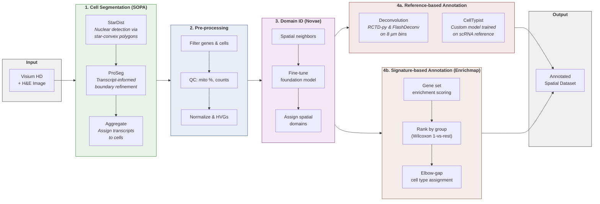

## Purpose of this tutorial

Working with high-resolution spatial transcriptomics platforms like Visium HD involves quite a few moving parts: segmenting cells, finding spatial domains, and annotating cell types. This tutorial walks through the full pipeline in Python, covering:

1. **Cell segmentation** with [SOPA](https://github.com/prism-oncology/sopa) (v2.2.1) <d-cite key="Blampey.2024"></d-cite>, using StarDist <d-cite key="Schmidt.2018"></d-cite> for nuclear detection and ProSeg <d-cite key="Jones.2024b"></d-cite> for transcript-based boundary refinement.
2. **Spatial domain identification** with [Novae](https://github.com/MICS-Lab/novae) (v1.0.3) <d-cite key="Blampey.2024b"></d-cite>, a graph-based foundation model with built-in batch correction.
3. **Cell type annotation** via two complementary approaches:
   - **Reference-based:** deconvolution on 8 µm bins with [RCTD-py](https://github.com/p-gueguen/rctd-py) (v0.3.0) <d-cite key="cable2022robust"></d-cite> and [FlashDeconv](https://github.com/cafferychen777/flashdeconv) (v0.1.6) <d-cite key="Yang.2025"></d-cite>, plus [CellTypist](https://www.celltypist.org/) (v1.7.1) on segmented cells using a scRNA-seq reference dataset.
   - **Signature-based (reference-free):** [Enrichmap](https://github.com/secrierlab/EnrichMap) (v0.1.29) <d-cite key="Celik.2025"></d-cite>, which computes spatially-aware enrichment scores (with batch correction on the fly) using gene set signatures.

We use the publicly available Human Colorectal Cancer (CRC) FFPE dataset from [10x Genomics](https://www.10xgenomics.com/datasets/visium-hd-cytassist-gene-expression-libraries-of-human-crc) and reproduce the main findings from their Loupe Browser tutorial, but entirely in Python (v3.11) and at single-cell resolution via cell segmentation. Check the supporting github repo [here](https://github.com/Rafael-Silva-Oliveira/segmentation-and-annotation.git) for the full script, dependencies (requirements.txt) and structure necessary to follow this tutorial.

---

## Spatial Transcriptomics: A primer

To really understand what's going on in a tissue, we need to know not just *which* genes a cell expresses, but also *where* that cell is relative to its neighbors. Spatial transcriptomics (ST) is a family of technologies that give you exactly that: spatially resolved gene expression <d-cite key="Moses.2022"></d-cite> <d-cite key="Cheng.2023"></d-cite>.

The field has moved fast, going from a handful of measurable genes to transcriptome-wide profiling at near-single-cell resolution <d-cite key="Yue.2023"></d-cite>, with applications across cancer biology <d-cite key="Chen.2024j"></d-cite> <d-cite key="Park.2023"></d-cite>, neuroscience, developmental biology, and drug discovery <d-cite key="Cao.2024b"></d-cite>. Below is a brief primer on the two main ST technology families and what they bring to the table compared to earlier approaches.

### Imaging-based Spatial Transcriptomics (iST) vs Sequencing-based Spatial Transcriptomics (sST)

ST technologies generally fall into two camps: **imaging-based** and **sequencing-based** <d-cite key="Williams.2022"></d-cite> <d-cite key="Cheng.2023"></d-cite>. Imaging-based methods can be further split into in situ hybridization (ISH) and in situ sequencing (ISS), while sequencing-based methods mostly rely on in situ capturing (ISC).

**Imaging-based ST (iST)** uses labeled probes that target specific genes, letting you visualize mRNA directly in tissue <d-cite key="Moses.2022"></d-cite>. This targeted approach gives high sensitivity and can reach subcellular or single-molecule resolution. Commercial platforms include MERFISH (Vizgen's MERSCOPE), Xenium (10x Genomics), and CosMx (NanoString). The downside is that you need to know which genes to target upfront, and the number of genes you can profile at once is limited compared to transcriptome-wide methods <d-cite key="Yue.2023"></d-cite>.

**Sequencing-based ST (sST)** uses spatially barcoded arrays to capture RNA from tissue sections, which then gets sequenced via NGS <d-cite key="Williams.2022"></d-cite>. Because it's unbiased and transcriptome-wide, no prior knowledge of target genes is needed, making it great for discovery-driven research.

The original Visium platform had 55 µm spots that typically captured a mixture of multiple cells. Visium HD brought this down to 2 µm bins with no gaps, enabling single-cell scale profiling. The tradeoff is that sequencing-based methods generally have lower transcript capture efficiency than imaging-based ones, since they rely on transcripts diffusing onto a capture surface rather than being detected directly in tissue <d-cite key="Cheng.2023"></d-cite>.

### What does Spatial Transcriptomics unlock compared to other transcriptomics techniques?

**1. Going beyond bulk RNA-seq.** Bulk RNA-seq averages gene expression across thousands of cells <d-cite key="Cao.2024b"></d-cite>, hiding cellular heterogeneity and discarding any spatial information. ST preserves both, letting you spot rare cell populations that would otherwise be invisible in the bulk signal.

**2. Adding context to scRNA-seq.** scRNA-seq gives you single-cell resolution, a step up from bulk-RNA, but still requires dissociating the tissue first, which destroys the spatial layout of cells <d-cite key="Chen.2024j"></d-cite>. It can also lose fragile cell types or introduce dissociation-induced stress artifacts <d-cite key="Williams.2022"></d-cite>. Cells with complex morphologies (e.g., neurons, glial cells) are particularly hard to recover intact <d-cite key="Park.2023"></d-cite>. ST profiles gene expression *in situ*, keeping cells in their original context without the need for dissociation.

**3. Enabling spatial analyses.** Because ST preserves coordinates, it opens up analyses that are simply not feasible with dissociated data:
- Cell-cell interactions and ligand-receptor signaling based on physical proximity <d-cite key="Chen.2024j"></d-cite>, which is key for understanding tumor microenvironments.
- Tissue niches and neighborhoods defined by both expression patterns and spatial location (e.g., tumor-stroma interfaces, tertiary lymphoid structures).
- Subcellular mRNA localization with imaging-based methods <d-cite key="Cheng.2023"></d-cite>, revealing how transcript positioning relates to function.

**4. Building spatial atlases.** ST enables 3D tissue reconstruction by aligning consecutive 2D sections <d-cite key="Khan.2025"></d-cite>, and spatiotemporal tracking of development at cellular resolution.



### Shift from Deconvolution (spot based) to Cell Segmentation (bin based)

With the original Visium (55 µm spots, each covering multiple cells), you needed **deconvolution** methods like RCTD <d-cite key="cable2022robust"></d-cite> to infer cell type mixtures within each spot using a scRNA-seq reference.

Visium HD changed this. With 2 µm bins, you can now do **cell segmentation** directly on the histology image and assign transcripts to individual cells using computational methods. This gives you a per-cell expression matrix (like scRNA-seq) but with spatial coordinates preserved. Each observation is a single segmented cell rather than a statistical mixture. That said, deconvolution methods are still useful. The 8 µm bins aggregate enough UMIs for robust inference, and reference-based approaches like RCTD and FlashDeconv can leverage scRNA-seq atlases to assign cell type proportions at the bin level. Later in this tutorial, I show both deconvolution on 8 µm bins and CellTypist annotation on segmented cells using a scRNA-seq reference, alongside signature-based annotation with Enrichmap.



This shift from deconvolution to segmentation is a key motivation for this tutorial: we get single-cell spatial transcriptomics without the assumptions that come with deconvolution.

---

## Exploring a Visium HD Dataset

For this tutorial we will use the Visium HD Human Colorectal Cancer (FFPE) dataset from 10x Genomics:
- [Loupe Browser HD tutorial](https://www.10xgenomics.com/support/software/loupe-browser/latest/tutorials/assay-analysis/lb-hd-spatial-gene-expression)
- [Dataset download page](https://www.10xgenomics.com/datasets/visium-hd-cytassist-gene-expression-libraries-of-human-crc)

Once you've downloaded the data, your project structure should look like this:

### Data Structure


spatial/
├── Microscopy/
│   ├── Visium_HD_Human_Colon_Cancer_image.tif
│   └── Visium_HD_Human_Colon_Cancer_tissue_image.btf
│
└── SpaceRanger/
	└── Visium_HD_Human_Colon_Cancer/
		└── outs/
			├── binned_outputs/
			│   ├── square_002um/
			│   ├── square_008um/
			│   └── square_016um/
			│
			└── spatial/
				├── aligned_fiducials.jpg
				├── aligned_tissue_image.jpg
				├── cytassist_image.tiff
				├── detected_tissue_image.jpg
				├── tissue_hires_image.png
				├── tissue_lowres_image.png
				├── Visium_HD_Human_Colon_Cancer_cloupe_008um.cloupe
				├── Visium_HD_Human_Colon_Cancer_feature_slice.h5
				├── Visium_HD_Human_Colon_Cancer_metrics_summary.csv
				├── Visium_HD_Human_Colon_Cancer_probe_set.csv
				└── Visium_HD_Human_Colon_Cancer_slide_file.vtf


Check this [repository link](https://github.com/Rafael-Silva-Oliveira/segmentation-and-annotation.git) to find all the full script and structure necessary to follow this tutorial .

The imports look like this:


import warnings
from datetime import datetime
from pathlib import Path

import decoupler as dc
import enrichmap as em
import matplotlib as mpl
import matplotlib.pyplot as plt
import novae
import numpy as np
import pandas as pd
import scanpy as sc
import seaborn as sns
import sopa
import spatialdata as sd
import spatialdata_plot
import yaml
import zarr
from anndata import AnnData
from loguru import logger
import spatialdata_plot

warnings.filterwarnings(
	"ignore",
	message="Use `squidpy.pl.spatial_scatter`",
)

# Matplotlib defaults
mpl.rcParams["figure.dpi"] = 300
plt.style.use("bmh")
plt.rcParams.update(
	{
		"figure.figsize": (12, 8),
		"axes.facecolor": "white",
		"axes.edgecolor": "black",
	}
)


The following code is used to set up the directories and logging. Note that we will also be using the `config_crc_tutorial.yaml` to store and load the configuration parameters. The markers you see in this file are the ones downloaded from the 10X website ([link](https://www.10xgenomics.com/support/software/loupe-browser/latest/tutorials/assay-analysis/lb-hd-spatial-gene-expression)) with some added genes for neutrophils as we need to have more than 1 gene per cell type signature to run the `Enrichmap` package later on this tutorial.

The `yaml` file looks like this:


# Visium HD CRC Tutorial Configuration
# 10x Genomics Human Colorectal Cancer (FFPE) dataset

# Base paths
paths:
  spaceranger_outs: "../data/spatial/SpaceRanger"
  processed: "../data/spatial/processed"
  figures: "../figures"

# Single sample for this tutorial
samples:
  - id: "Visium_HD_Human_Colon_Cancer"
	name: "CRC_tutorial"

# Analysis parameters
params:
  filter_genes_counts: 1
  filter_cells_counts: 1
  radius: 50
  percentile_pct_mito: null
  pct_mito: 10
  novae_max_epochs: 50
  novae_model: "MICS-Lab/novae-human-0"
  domain_range: [5, 15]
  clustering_col: "novae_domains_15"

# Marker genes for CRC cell type annotation
# Source: 10x Genomics Loupe Browser CRC tutorial CSVs (data/markers/*.csv)
marker_genes:
  Tumor: ["REG1A", "REG1B", "CEACAM6", "TGFBI"]
  Fibroblasts: ["COL1A1", "MMP2"]
  Macrophages: ["LYZ", "SPP1"]
  Neutrophils: ["SAT1", "CSF3R", "FCGR3B", "S100A8"]
  Goblet_cells: ["FCGBP", "MUC2", "CLCA1"]




PROJECT_DIR = Path(
	r"C:\Users\Projects\segmentation-and-annotation"
).resolve()
CONFIG_PATH = (
	PROJECT_DIR
	/ "scripts"
	/ "config_crc_tutorial.yaml"
)

with open(CONFIG_PATH, "r") as f:
	cfg = yaml.safe_load(f)

sample_id = cfg["samples"][0]["id"]
sample_name = cfg["samples"][0]["name"]
params = cfg["params"]
marker_genes = cfg["marker_genes"]

PROCESSED_DIR = (
	PROJECT_DIR
	/ "data"
	/ "spatial"
	/ "processed"
).resolve()
FIGURES_DIR = (
	PROJECT_DIR / "figures"
).resolve()

run_name = f"crc_tutorial_{datetime.now().strftime('%d%m%Y_%H%M')}"
run_dir = (
	PROCESSED_DIR / run_name
).resolve()
run_dir.mkdir(
	parents=True, exist_ok=True
)
(run_dir / "figures").mkdir(
	exist_ok=True
)

logger.info(f"Run directory: {run_dir}")
logger.info(
	f"Sample: {sample_id} ({sample_name})"
)



### Reading the data

Once we have the downloaded files and in the project structure above, we can read the data using the `sopa` package <d-cite key="Blampey.2024"></d-cite> as follows:


logger.info(
	"=== STEP 1: Reading Visium HD data and running segmentation ==="
)

sdata = sopa.io.visium_hd(
	str(
		PROJECT_DIR
		/ "data"
		/ "spatial"
		/ "SpaceRanger"
		/ sample_id
		/ "outs"
	),
	dataset_id=sample_id,
	fullres_image_file=str(
		PROJECT_DIR
		/ "data"
		/ "spatial"
		/ "Microscopy"
		/ "Visium_HD_Human_Colon_Cancer_tissue_image.btf"
	),
)



In order to speed things up, we will use a subset of the data. We can crop the dataset like this:

sdata_sub = sd.bounding_box_query(
	sdata,
	min_coordinate=[51000, 9000],
	max_coordinate=[56000, 14000],
	axes=("x", "y"),
	target_coordinate_system=sample_id,
	filter_table=True,
)

# Make the var_names unique, but not required for this tutorial
<!-- for (
	key,
	table,
) in sdata_sub.tables.items():
	table.var_names_make_unique() -->

<!-- sdata_sub.write("sdata_subset.zarr")  # save it - might have to downgrade the package ome-zarr to 0.13.0 to save the sdata objects. Thanks to @vtriantafyl for pointing this out! --> 



Which gives the following SpatialData object (to find out more about SpatialData check this [repository link](https://github.com/scverse/spatialdata)):


SpatialData object
├── Images
│     ├── 'Visium_HD_Human_Colon_Cancer_full_image': DataTree[cyx] (3, 5000, 5000), (3, 2500, 2500), (3, 1250, 1250), (3, 625, 625), (3, 313, 313)
│     ├── 'Visium_HD_Human_Colon_Cancer_hires_image': DataArray[cyx] (3, 398, 399)
│     └── 'Visium_HD_Human_Colon_Cancer_lowres_image': DataArray[cyx] (3, 40, 40)
├── Shapes
│     ├── 'Visium_HD_Human_Colon_Cancer_square_002um': GeoDataFrame shape: (470416, 1) (2D shapes)
│     ├── 'Visium_HD_Human_Colon_Cancer_square_008um': GeoDataFrame shape: (29659, 1) (2D shapes)
│     ├── 'Visium_HD_Human_Colon_Cancer_square_016um': GeoDataFrame shape: (7500, 1) (2D shapes)
│     ├── 'image_patches': GeoDataFrame shape: (9, 3) (2D shapes)
│     ├── 'region_of_interest': GeoDataFrame shape: (1, 1) (2D shapes)
│     └── 'stardist_boundaries': GeoDataFrame shape: (12419, 1) (2D shapes)
└── Tables
	  ├── 'square_002um': AnnData (470416, 18085)
	  ├── 'square_008um': AnnData (29659, 18085)
	  └── 'square_016um': AnnData (7500, 18085)
with coordinate systems:
	▸ 'Visium_HD_Human_Colon_Cancer', with elements:
		Visium_HD_Human_Colon_Cancer_full_image (Images), Visium_HD_Human_Colon_Cancer_hires_image (Images), Visium_HD_Human_Colon_Cancer_lowres_image (Images), Visium_HD_Human_Colon_Cancer_square_002um (Shapes), Visium_HD_Human_Colon_Cancer_square_008um (Shapes), Visium_HD_Human_Colon_Cancer_square_016um (Shapes), image_patches (Shapes), region_of_interest (Shapes), stardist_boundaries (Shapes)
	▸ 'Visium_HD_Human_Colon_Cancer_downscaled_hires', with elements:
		Visium_HD_Human_Colon_Cancer_hires_image (Images), Visium_HD_Human_Colon_Cancer_square_002um (Shapes), Visium_HD_Human_Colon_Cancer_square_008um (Shapes), Visium_HD_Human_Colon_Cancer_square_016um (Shapes), region_of_interest (Shapes)
	▸ 'Visium_HD_Human_Colon_Cancer_downscaled_lowres', with elements:
		Visium_HD_Human_Colon_Cancer_lowres_image (Images), Visium_HD_Human_Colon_Cancer_square_002um (Shapes), Visium_HD_Human_Colon_Cancer_square_008um (Shapes), Visium_HD_Human_Colon_Cancer_square_016um (Shapes), region_of_interest (Shapes)
	▸ 'microns', with elements:
		Visium_HD_Human_Colon_Cancer_square_002um (Shapes), Visium_HD_Human_Colon_Cancer_square_008um (Shapes), Visium_HD_Human_Colon_Cancer_square_016um (Shapes), region_of_interest (Shapes)


We can then plot the tissue image and the cropped image like this:

sdata_sub.pl.render_images(
	f"{sample_id}_full_image"
).pl.show(
	coordinate_systems=sample_id,
	figsize=(10, 10),
)



Which would look something like this:


---

## Cell Segmentation in Single Cell Spatial Transcriptomics using SOPA

Now that the data is loaded and cropped, we can segment the cells. We'll use [sopa](https://github.com/prism-oncology/sopa) <d-cite key="Blampey.2024"></d-cite> (Spatial Omics Pipeline and Analysis), a technology-invariant pipeline built on [SpatialData](https://spatialdata.scverse.org/) that works across Xenium, MERSCOPE, CosMx, Visium HD, and others.

For segmentation, sopa uses a patch-based approach: it splits the tissue image into patches, segments each one, and stitches the results back together. This keeps memory usage manageable even for large whole-slide images.


# Patch-based cell segmentation
logger.info("Creating image patches...")
sopa.make_image_patches(sdata_sub)


### The landscape of cell segmentation methods

Cell segmentation matters because everything downstream (domain identification, cell type annotation, cell-cell interactions) depends on getting cell boundaries right. The transcript-informed segmentation landscape breaks down into three broad families:

**CNNs and Transformers:** BIDCell, Bin2Cell, SCS, UCS, Bering, [InstanSeg](https://github.com/instanseg/instanseg) (fluorescence and brightfield microscopy images), [Cellpose-SAM](https://github.com/mouseland/cellpose?tab=readme-ov-file) <d-cite key="Pachitariu.2025"></d-cite>, GeneSegNet, and StarDist <d-cite key="Schmidt.2018"></d-cite> (the default in SOPA).

**Graph-based methods:** Segger and ComSeg.

**Probabilistic/Bayesian methods:** ProSeg <d-cite key="Jones.2024b"></d-cite> and Baysor.

Which one you pick depends on what inputs you have (H&E/DAPI images, nuclear staining, transcript coordinates) and your computational budget. In this tutorial, we use a two-step approach using the wrapper `sopa`: **StarDist** for initial HE segmentation, then **ProSeg** to refine those boundaries using transcript locations. 

Other noteworthy wrappers include [harpy](https://github.com/saeyslab/harpy), a toolkit for (spatial) transcriptomics analysis that offers tutorials on cell segmentation using `cellpose` and `instanseg`, as well as `LazySlide` <d-cite key="Zheng.2026"></d-cite>, which provides functionality for data processing, visualization, cell segmentation (via `InstanSeg`), cell type annotation, spatial domain detection, and additional downstream analyses.

You may also find `ResolVI`<d-cite key="ergen_resolvi_2025"></d-cite> interesting, which is described by the authors as "...a model that operates downstream of any segmentation algorithm to generate a probabilistic representation, correcting for misassignment of molecules, as well as for batch effects and other nuisance factors", as an alternative to `proseg` or even after performing `proseg`. Check it out in `scvi-tools`.

### StarDist

StarDist <d-cite key="Schmidt.2018"></d-cite> detects nuclei by representing them as **star-convex polygons**. For each pixel, it predicts the probability of belonging to a nucleus and the distances to the object boundary along a set of radial directions. This works much better than bounding boxes for rounded nuclei and handles crowded cells well, where other methods tend to merge neighboring cells or miss them entirely.


logger.info(
	"Running StarDist segmentation..."
)
sopa.segmentation.stardist(
	sdata_sub, min_area=20
)
sdata_sub.pl.render_images(
	f"{sample_id}_full_image"
).pl.render_shapes(
	"stardist_boundaries",
	outline=True,
	fill_alpha=0,
	outline_alpha=0.6,
	outline_color="yellow",
).pl.show(
	coordinate_systems=sample_id,
	figsize=(12, 12),
	title="StarDist Cell Segmentation",
)


Which gives the following segmentation result:


### Proseg

ProSeg <d-cite key="Jones.2024b"></d-cite> takes a different approach: instead of relying on images alone, it infers cell boundaries from the spatial distribution of transcripts using *ab initio* cell simulation. It models cell shapes as probabilistic distributions and iteratively adjusts boundaries to best explain where the transcripts are, while preserving cell type heterogeneity.

The nice thing about ProSeg is that it can take prior segmentation results (like our StarDist boundaries) as a starting point and refine them using transcript information. So StarDist gives us the initial nuclear outlines from the H&E, and ProSeg adjusts those to better match the actual extent of each cell. In benchmarks across three commercial platforms, ProSeg shows strong performance and helps with difficult-to-segment cells like tumor-infiltrating immune cells (neutrophils, T cells).


logger.info(
	"Running ProSeg refinement..."
)
sopa.segmentation.proseg(
	sdata_sub,
	prior_shapes_key="stardist_boundaries",
)

sdata_sub.pl.render_images(
	f"{sample_id}_full_image"
).pl.render_shapes(
	"proseg_boundaries",
	outline=True,
	fill_alpha=0,
	outline_alpha=0.6,
	outline_color="yellow",
).pl.show(
	coordinate_systems=sample_id,
	figsize=(12, 12),
	title="ProSeg Cell Segmentation Refinement",
)


Which gives the following segmentation result:

Once we have the segmentation, we can aggregate the gene expression to the cells (As seen in the `sopa` tutorial, this is mandatory if you used stardist only, but optional if you ran proseg)

logger.info(
	"Aggregating gene expression to cells..."
)
sopa.aggregate(
	sdata_sub,
	aggregate_channels=False,
	expand_radius_ratio=1,
)

This will give a new table in the `sdata_sub.tables["table"]` with the aggregated/segmented gene expression. It looks something like this:

SpatialData object
├── Images
│     ├── 'Visium_HD_Human_Colon_Cancer_full_image': DataTree[cyx] (3, 5000, 5000), (3, 2500, 2500), (3, 1250, 1250), (3, 625, 625), (3, 313, 313)
│     ├── 'Visium_HD_Human_Colon_Cancer_hires_image': DataArray[cyx] (3, 398, 399)
│     └── 'Visium_HD_Human_Colon_Cancer_lowres_image': DataArray[cyx] (3, 40, 40)
├── Shapes
│     ├── 'Visium_HD_Human_Colon_Cancer_square_002um': GeoDataFrame shape: (470416, 1) (2D shapes)
│     ├── 'Visium_HD_Human_Colon_Cancer_square_008um': GeoDataFrame shape: (29659, 1) (2D shapes)
│     ├── 'Visium_HD_Human_Colon_Cancer_square_016um': GeoDataFrame shape: (7500, 1) (2D shapes)
│     ├── 'image_patches': GeoDataFrame shape: (9, 3) (2D shapes)
│     ├── 'proseg_boundaries': GeoDataFrame shape: (12394, 2) (2D shapes)
│     ├── 'region_of_interest': GeoDataFrame shape: (1, 1) (2D shapes)
│     └── 'stardist_boundaries': GeoDataFrame shape: (12419, 1) (2D shapes)
└── Tables
	  ├── 'square_002um': AnnData (470416, 18085)
	  ├── 'square_008um': AnnData (29659, 18085)
	  ├── 'square_016um': AnnData (7500, 18085)
	  └── 'table': AnnData (12394, 18085)
with coordinate systems:
	▸ 'Visium_HD_Human_Colon_Cancer', with elements:
		Visium_HD_Human_Colon_Cancer_full_image (Images), Visium_HD_Human_Colon_Cancer_hires_image (Images), Visium_HD_Human_Colon_Cancer_lowres_image (Images), Visium_HD_Human_Colon_Cancer_square_002um (Shapes), Visium_HD_Human_Colon_Cancer_square_008um (Shapes), Visium_HD_Human_Colon_Cancer_square_016um (Shapes), image_patches (Shapes), proseg_boundaries (Shapes), region_of_interest (Shapes), stardist_boundaries (Shapes)
	▸ 'Visium_HD_Human_Colon_Cancer_downscaled_hires', with elements:
		Visium_HD_Human_Colon_Cancer_hires_image (Images), Visium_HD_Human_Colon_Cancer_square_002um (Shapes), Visium_HD_Human_Colon_Cancer_square_008um (Shapes), Visium_HD_Human_Colon_Cancer_square_016um (Shapes), proseg_boundaries (Shapes), region_of_interest (Shapes)
	▸ 'Visium_HD_Human_Colon_Cancer_downscaled_lowres', with elements:
		Visium_HD_Human_Colon_Cancer_lowres_image (Images), Visium_HD_Human_Colon_Cancer_square_002um (Shapes), Visium_HD_Human_Colon_Cancer_square_008um (Shapes), Visium_HD_Human_Colon_Cancer_square_016um (Shapes), proseg_boundaries (Shapes), region_of_interest (Shapes)
	▸ 'microns', with elements:
		Visium_HD_Human_Colon_Cancer_square_002um (Shapes), Visium_HD_Human_Colon_Cancer_square_008um (Shapes), Visium_HD_Human_Colon_Cancer_square_016um (Shapes), proseg_boundaries (Shapes), region_of_interest (Shapes)


This is the `AnnData` object that we will be using (segmented cells) to run domain identification and cell type annotation.
Let's save this segmented data:

segmented_h5ad = (
	PROJECT_DIR
	/ "data"
	/ "spatial"
	/ "segmented.h5ad"
)
sdata_sub.tables["table"].write_h5ad(
	str(segmented_h5ad)
)
logger.info(
	f"Saved segmented table to {segmented_h5ad}"
)


---

### Pre-processing
Before running domain identification, let's do some pre-processing (e.g., filtering cell and gene counts, removing cells with mitochondrial percentage above a certain threshold, etc.).

logger.info(
	"=== STEP 2: Filtering, preprocessing, and Novae clustering ==="
)

adata = sc.read_h5ad(
	str(segmented_h5ad)
)

# Filter genes and cells
logger.info(
	f"AnnData shape before filtering: {adata.shape}"
)
sc.pp.filter_genes(
	adata,
	min_counts=params[
		"filter_genes_counts"
	],
)
sc.pp.filter_cells(
	adata,
	min_counts=params[
		"filter_cells_counts"
	],
)
logger.info(
	f"AnnData shape after filtering: {adata.shape}"
)

# QC metrics
vmax_pct = 99
adata.var["mt"] = (
	adata.var_names.str.startswith(
		("MT-", "mt-")
	)
)
sc.pp.calculate_qc_metrics(
	adata,
	inplace=True,
	percent_top=None,
)
sc.pp.calculate_qc_metrics(
	adata,
	qc_vars=["mt"],
	inplace=True,
	percent_top=None,
)



Let's create some plots resulting from the QC filtering:


# Plot n_counts
fig = sc.pl.spatial(
	adata,
	color="n_counts",
	vmin=np.percentile(
		adata.obs["n_counts"], 1
	),
	vmax=np.percentile(
		adata.obs["n_counts"], vmax_pct
	),
	spot_size=10,
	show=False,
	return_fig=True,
)
fig.savefig(
	f"{run_dir}/n_counts_{sample_id}.png",
	bbox_inches="tight",
	dpi=150,
)
plt.close(fig)


Spatial distribution of total counts per cell:



# Plot mito percentage
fig = sc.pl.spatial(
	adata,
	color="pct_counts_mt",
	vmin=np.percentile(
		adata.obs["pct_counts_mt"], 1
	),
	vmax=np.percentile(
		adata.obs["pct_counts_mt"],
		vmax_pct,
	),
	spot_size=10,
	show=False,
	return_fig=True,
)
fig.savefig(
	f"{run_dir}/pct_counts_mt_{sample_id}.png",
	bbox_inches="tight",
	dpi=150,
)
plt.close(fig)





# Filter high mito cells
pct_to_remove = params["pct_mito"]
if (
	params["percentile_pct_mito"]
	is not None
):
	pct_to_remove = adata.obs[
		"pct_counts_mt"
	].quantile(
		params["percentile_pct_mito"]
	)

adata = adata[
	adata.obs["pct_counts_mt"]
	< pct_to_remove
].copy()
logger.info(
	f"After mito filtering ({pct_to_remove}%): {adata.shape}"
)

# Plot mito after filtering
fig = sc.pl.spatial(
	adata,
	color="pct_counts_mt",
	spot_size=10,
	show=False,
	return_fig=True,
)
fig.savefig(
	f"{run_dir}/mt_after_filtering_{sample_id}.png",
	bbox_inches="tight",
	dpi=150,
)
plt.close(fig)




{% details Why is it important to filter regions with high % of MT? Biology or Artifact? %}

Although this example uses a different dataset from the tutorial, it highlights an important thing: regions with a high percentage of mitochondrial (MT) genes can be identified by tools like `Novae` as distinct spatial domains, when in reality they may simply reflect elevated MT content. In some cases, this is biologically meaningful, for example, high MT percentages can indicate cell death or disease progression, making these domains genuinely relevant. However, in other cases, such as FFPE samples, the elevated MT signal may be an artifact: the extremities of the tissue are exposed to harsher conditions during sample prep/embedding, leading to greater cellular stress and, consequently, higher MT percentages compared to the inner tissue.

Have a look at this figure:



You can see that the regions of this sample that have highest % of MT are the extremities of the sample. 

Now look at the domains that were obtained using `novae` (which you will see how to use in the next section):



You can see that novae has captured this region of high % of MT as being a niche/domain. And while it certainly can be due to biology, it can also be due to artifacts as I mentioned above (especially in the extremities of FFPE samples or issues during sample preparation).




Another thing we can do is to remove sparse spatial regions using computed connectivities. This is a good idea if we have a sample that is not as compact as the dataset we are working with, where we may have "isolated islands" of cells. This should be evaluated on a project bases, as these islands could be real and not artifacts from sample preparation. 

We can do this using the `connected_components` function from `scipy.sparse.csgraph`. This function below requires connectivities to be calculated first, which we will do in the next section with `Novae`.


def filter_isolated_regions(
	adatas,
	min_cells=2000,
	run_dir=None,
	remove_specific_regions=None,
):
	from scipy.sparse.csgraph import (
		connected_components,
	)

	for i, adata in enumerate(adatas):
		coords = adata.obsm["spatial"]

		sample_id = adata.obs[
			"sample_id"
		].unique()[0]

		logger.info(
			f"Running region filtering based on number of cells (removing isolated islands). {sample_id}"
		)

		print(
			f"X range: {coords[:, 0].min():.1f} - {coords[:, 0].max():.1f}"
		)
		print(
			f"Y range: {coords[:, 1].min():.1f} - {coords[:, 1].max():.1f}"
		)

		n_components, labels = (
			connected_components(
				adata.obsp[
					"spatial_connectivities"
				],
				directed=False,
			)
		)
		adata.obs["spatial_region"] = (
			labels.astype(str)
		)
		print(
			f"Found {n_components} spatial regions"
		)

		# Count cells per region
		region_counts = adata.obs[
			"spatial_region"
		].value_counts()
		print(region_counts)

		large_regions = region_counts[
			region_counts >= min_cells
		].index.tolist()
		print(
			f"Large regions (>={min_cells} cells): {large_regions}"
		)

		# Tag regions as "main" or "island"
		adata.obs["region_type"] = (
			adata.obs[
				"spatial_region"
			].apply(
				lambda x: "main"
				if x in large_regions
				else "island"
			)
		)

		# Visualize the regions
		fig, axes = plt.subplots(
			1, 3, figsize=(14, 5)
		)

		# Plot all regions colored
		sc.pl.embedding(
			adata,
			basis="spatial",
			color="spatial_region",
			ax=axes[0],
			show=False,
			title="All spatial regions (based on connectivities)",
		)

		# Plot main vs island
		sc.pl.embedding(
			adata,
			basis="spatial",
			color="region_type",
			ax=axes[1],
			show=False,
			title="Main vs Islands",
		)

		if (
			remove_specific_regions
			is not None
		):
			if (
				sample_id
				in remove_specific_regions
			):
				regions_to_remove = remove_specific_regions[
					sample_id
				]
				adata = adata[
					~adata.obs[
						"spatial_region"
					].isin(
						regions_to_remove
					)
				]

				logger.info(
					f"Removed user defined regions from {sample_id}: {regions_to_remove}"
				)
		cells_before_filtering = (
			adata.n_obs
		)
		# Filter to keep only main regions
		adata = adata[
			adata.obs["region_type"]
			== "main"
		]
		cells_after_filtering = (
			adata.n_obs
		)
		print(
			f"Filtered: {cells_before_filtering} -> {cells_after_filtering} cells"
		)
		sc.pl.embedding(
			adata,
			basis="spatial",
			color="region_type",
			ax=axes[2],
			show=False,
			title="After filtering isolated islands",
		)
		plt.tight_layout()

		if run_dir is not None:
			plt.savefig(
				f"{run_dir}/spatial_regions_{sample_id}.png",
				dpi=300,
				bbox_inches="tight",
			)
		else:
			plt.savefig(
				f"spatial_regions_{sample_id}.png",
				dpi=300,
				bbox_inches="tight",
			)
		plt.show()

		adatas[i] = adata.copy()

	return adatas


This is an example of the output from the code above, where one identify and remove the "islands" of cells that are not connected to the main regions of cells. This image is not related to the Visium HD dataset for this tutorial, and is simply an example of how this can be used to remove isolated islands of cells that don't meet certain criteria. 




## Spatial Clustering and Domain Identification with Novae

With segmented cells and pre-processed data, the next step is to find **spatial domains/niches**: tissue regions (tissue architecture) that share similar expression patterns and spatial organization (think tumor, stroma, immune infiltrates, normal mucosa).

We'll use [Novae](https://github.com/MICS-Lab/novae) <d-cite key="Blampey.2024b"></d-cite>, a graph-based foundation model pre-trained on ~30 million cells across 18 tissues. It can do zero-shot domain inference across different gene panels, tissues, and technologies. Some cool things that it can do out of the box:

- It handles **batch correction** natively during representation learning, so no separate correction step is needed when working with multiple slides.
- It builds a **hierarchical domain structure**, so you can explore tissue organization at different resolutions.
- As a **foundation model**, it generalizes to new datasets without extensive fine-tuning.

An alternative worth mentioning is [SpatialLeiden](https://github.com/HiDiHlabs/SpatialLeiden), a spatially-aware version of the Leiden algorithm. It uses a multiplex graph combining gene expression with spatial topology, and a `layer_ratio` parameter lets you balance the two. It integrates with the scverse ecosystem and works across Visium, Stereo-seq, and imaging-based platforms. However, it does not (yet) perform batch correction out of the box. Thus, a batch correction method such as `Harmony` or `scVI` can be used. 

Check out this contribution I posted on the SpatialLeiden GitHub repository for more details: [link](https://github.com/HiDiHlabs/SpatialLeiden/issues/22). Edit March 19th, 2026: This contribution was turned into a tutorial, using `Harmony` with `SpatialLeiden` [here](https://spatialleiden.readthedocs.io/latest/guides/multisample.html).

One can also use [UTAG](https://github.com/ElementoLab/utag) <d-cite key="Kim.2022b"></d-cite> for unsupervised discovery of tissue architecture.

Other options for niche discovery include [SpatialFusion](https://uhlerlab.github.io/spatialfusion/), a deep-learning multimodal model for niche discovery using pathway-informed spatial niche mapping. Check the preprint here: [SpatialFusion: A lightweight multimodal foundation model for pathway-informed spatial niche mapping](https://www.biorxiv.org/content/10.64898/2026.03.16.712056v1).

One can also use text feature extraction methods (vision language models) instead of typical vision models. Examples of such text feature extraction models are `PLIP` <d-cite key="Huang.2023e"></d-cite> and `CONCH` <d-cite key="Lu.2024b"></d-cite>. Feel free to check one of `LazySlide` [tutorials](https://lazyslide.readthedocs.io/en/stable/tutorials/feature_extraction.html) to see how one could do this.

Finally, it is worth considering these domains, niches, and tissue organizations as gradients rather than discrete categories. Most spatial transcriptomics tools assign each cell to a single niche, which obscures the borders and continuous transitions that naturally occur within tissue architecture. To address this, newer packages such as [MINGL](https://github.com/HickeyLab/Mingl/tree/main) <d-cite key="batavia_mingl_2026"></d-cite> capture tissue organization through continuous measures rather than hard assignments.

For this tutorial we go with `novae` for its foundation model capabilities and hierarchical domains.

> It is easy to get lost with all the different methods being released on a weekly basis (especially for recent methods such as spatial transcriptomics), so it is important to focus on those tools/packages that 1) work/generalize well enough, 2) are easy to install, and 3) have a good documentation.

The first step with Novae is computing spatial neighbors via `spatial_neighbors`, which takes a `radius` parameter. For this cropped region, we use a radius of 50.

Note that neighbors/connectivities need to be computed per sample. If you have multiple samples in one `AnnData` object, use the `slide_key` parameter to compute them separately.


logger.info(
	"Computing spatial neighbors."
)
novae.spatial_neighbors(
	[adata],
	radius=params["radius"],
	coord_type="generic", # "generic" for cell segmented data, "grid" when using the bins from VisiumHD. Useful if you want to perform cell type deconvolution on the VisiumHD bins. More info on such methods later in the tutorial.
	<!-- technology="visium_hd", # Only needed if using the "grid" coord_type. -->
)

novae.plot.connectivities([adata])
plt.savefig(
	f"{run_dir}/connectivities.png",
	dpi=600,
	bbox_inches="tight",
)
plt.close()




This radius parameter is important as too low of a radius will result in very sparse connectivities, missing important spatial relationships, while too high of a radius will start connecting cells that are not actually connected. See example of images below:

Radius of 20


Radius of 150


Novae also provides some useful utilities for normalization of the data. We can do it using this:


logger.info("Preprocessing with Novae")
novae.utils.prepare_adatas([adata]) # performs lognorm, highly variable genes, among others. 
# Copy the lognorms computed from novae to adata layers.
adata.layers["lognorm_counts"] = (
	adata.X.copy()
)


Let's also compute the PCA using the highly variable genes computed from `Novae` in the previous `prepare_adatas` step:

logger.info("Running PCA")
sc.pp.pca(
	adata, use_highly_variable=True
)


Now, one can use the Novae model to fine-tune it on our own dataset. We load a pre-trained model and fine-tune it as follows:

# Novae clustering
logger.info(
	"Fine-tuning Novae model..."
)
model = novae.Novae.from_pretrained(
	params["novae_model"]
)
# See more on the Novae documentation: https://mics-lab.github.io/novae/
model.fine_tune(
	[adata],
	max_epochs=params[
		"novae_max_epochs"
	],
)
model.save_pretrained(
	str(run_dir / "model")
)


You can find more detailed information on fine-tuning and how to use H&E embeddings to improve model performance in the [Novae documentation](https://mics-lab.github.io/novae/). For this tutorial, we will use the `zero_shot` parameter to compute representations. This leverages the pre-trained model's learned representations to cluster cells without requiring task-specific training.


logger.info(
	"Computing Novae representations..."
)
# Inference based on zero_shot
model.compute_representations(
	[adata], zero_shot=True
)


We can then use the model to assign domains from a range of domains we wish to test. We will also save these domain assignments to the `adata.obs` table and save both spatial plots and domain proportions plots.



# Assign domains across a range of resolutions
domain_min, domain_max = params[
	"domain_range"
]
for n_domains in range(
	domain_min, domain_max + 1
):
	col = f"novae_domains_{n_domains}"
	model.assign_domains(
		[adata], level=n_domains
	)

	adata.obsm[
		f"novae_latent_{n_domains}"
	] = adata.obsm[
		"novae_latent"
	].copy()

	novae.plot.domains(
		[adata],
		cell_size=8,
		show=False,
		obs_key=col,
	)
	plt.savefig(
		str(
			run_dir
			/ f"domains_{n_domains}.png"
		),
		dpi=600,
		bbox_inches="tight",
	)
	plt.close()

	novae.plot.domains_proportions(
		[adata], obs_key=col, show=False
	)
	plt.savefig(
		str(
			run_dir
			/ f"domains_proportions_{n_domains}.png"
		),
		dpi=600,
		bbox_inches="tight",
	)
	plt.close()



We will use the `novae_domains_8` domain assignments from `adata.obs` for this tutorial. We get the following plots:



Domain proportions for the 8 novae domains:


Since the previous steps of segmentation and domain identification can take a while to run, let's save the `adata` object to a file.


# Save clustered AnnData
adata.write_h5ad(
	str(
		run_dir
		/ f"{sample_id}_clustered.h5ad"
	)
)
logger.info(
	f"Saved clustered AnnData: {adata.shape}"
)

---

## Cell Type Annotation with and without a scRNA reference dataset

For cell type annotation on spatial datasets, there are several routes one can choose from. Do note however that cell type annotation is very much so a work in progress in the field. A great blog post from `octopath.ai` specifies this, and the following couple of paragraphs you are about to read is a very short summary of this blog post that you can find [here](https://octopath.ai/blog/about-ground-truth-in-ai-single-cell-detection).

Three major sources of “ground truth” each introduce their own systematic biases:

- **Human annotation:** - Pathologists frequently disagree, especially for morphologically diffuse classes like macrophages which can take several shapes. Inter‑observer agreement can be as low as ~60–70%, meaning models trained on one annotator’s labels inherit that annotator’s biases.

- **IHC/IF markers:** Molecular staining feels objective but is riddled with failure modes, from uneven antibody penetration, nonspecific binding, registration errors between IF and H&E, and arbitrary thresholding. A true T cell may fall below threshold, while a non‑T cell may show enough noise to be labeled positive.

- **Spatial transcriptomics:** Transcript capture is sparse (often 10–30%), segmentation is imperfect, and cell type calls depend on clustering choices. The “ground truth” becomes whatever the clustering algorithm and human interpretation decide, not an absolute biological fact.

One other central problem highlighted is the sparse annotation problem <d-cite key="YusukeNiitani"></d-cite>: datasets rarely label all cells of a given type. For example, if only three of ten lymphocytes are annotated, a detection model may be punished for correctly identifying the other seven (data distrubiton issue). This leads to yet another issue which is feature‑dependent label noise, also quite damaging to cell annotation, because the missing labels may now correlate with biological or technical properties (e.g., weak staining due to tissue depth, etc). Models then learn to avoid detecting exactly the cells they should detect.

One other concern is that some cell classes (e.g., macrophages) have extremely diffuse morphology, making consistent labeling nearly impossible. Even perfect models cannot exceed the ceiling imposed by noisy, biased labels.

We also have the stain‑from‑H&E prediction pipelines <d-cite key="Latonen.2024"></d-cite>: even when models achieve good correlations, they are learning to reproduce the measurement noise of IF, not necessarily the underlying biology. 

In summary, cell type annotation is far from perfect, and what we are getting from the methods below is, at most, a coarse classification of the cell type heterogeneity in the tissue we are analyzing, so keep that in mind!

### **Using a scRNA reference dataset (deconvolution with RCTD-py and FlashDeconv, and cell type annotation with CellTypist on segmented cells)**

- **Deconvolution:** If you want to perform the typical cell type deconvolution on the Visium HD bins (usually the 8 micron bins for memory management), one can use reference-based methods like RCTD <d-cite key="cable2022robust"></d-cite> (see the Python implementation [here](https://github.com/p-gueguen/rctd-py)) or [FlashDeconv](https://github.com/cafferychen777/flashdeconv). 

Other options include `Crescendo` <d-cite key="millard_batch_2025"></d-cite>, an R package that removes batch effects directly at the gene expression level, making it possible to accurately visualize expression patterns across multiple samples. Notably, the `Crescendo` authors show that it can also harmonize data across different technologies, showcasing this by jointly integrating a scRNA-seq colorectal cancer (CRC) dataset with CRC spatial transcriptomics samples — the same cancer type covered in this tutorial. Overall, it is advised to perform batch-correction. For spot based spatial techhnologies, besides the tools already mentioned here, one could also consider `Stereoscope` <d-cite key="andersson_single-cell_2020"></d-cite> or `cell2location` <d-cite key="kleshchevnikov_cell2location_2022"></d-cite>, with `cell2location` "estimating the signatures from the reference data using a Negative Binomial regression model which can also account for batch effects and additional categorical covariate".

Check out the review titled **Cell-type deconvolution methods for spatial transcriptomics** <d-cite key="GaspardBoulinc.2025"></d-cite> for a more in depth overview of cell-type deconvolution methods in spatial transcriptomics. 

> I will be making a new tutorial focusing more on multi-modal integration which will include batch correction and deconvolution, so stay tuned for that! In this tutorial, we are running deconvolution without batch correction with the reference scRNA-seq dataset, so keep that extra step in mind depending on the methods you decide to use.

- **Cell type annotation:** Alternatively, if you wish to perform cell type annotation using the segmented cells from StarDist/ProSeg (or another cell segmentation method of your choice) AND you have a scRNA-seq reference dataset, you could train your own custom model using this scRNA reference dataset using something like [CellTypist](https://www.celltypist.org/) and then use this custom model to predict the cell types on your Visium HD cell segmented cells.

While the main focus of this tutorial is to use cell type signatures to annotate cell types, I will show an optional step to perform cell type annotations using **1)** deconvolution methods with the 8 micron bins using both `RCTD-py` (v0.3.0) and `FlashDeconv` (v0.1.6) and **2)** a custom model trained on a scRNA-seq reference dataset using `CellTypist` (v1.7.1) on the segmented cells from `sopa` (our `adata` object above).

We can download a CRC scRNA reference dataset using `cellxgene_census`, but as of this date, python 3.11 is not yet supported, so lets download a reference dataset instead like this:


import urllib.request, os

ref_url = "https://datasets.cellxgene.cziscience.com/0ca03016-58ec-4d4e-86d9-22dda860bc8c.h5ad"
ref_path = "pelka_crc_all_cells.h5ad"

if not os.path.exists(ref_path):
	print("Downloading Pelka et al. CRC reference (~370k cells)...")
	urllib.request.urlretrieve(ref_url, ref_path)

adata_ref = sc.read_h5ad(ref_path)
ct_col = "ClusterMidway" # cell type column we will be using
print(adata_ref.obs[ct_col].value_counts())

EpiT            108131
Epi              60164
Plasma           37809
TCD4             34598
B                25660
TCD8             23486
Macro            20280
Mono             14242
Tgd               9383
Endo              7520
DC                5549
Fibro             5231
TZBTB16           4742
NK                3924
Mast              3834
Granulo           2043
Peri              1525
SmoothMuscle       881
ILC                832
Schwann            281



This reference file looks something like:


AnnData object with n_obs × n_vars = 370115 × 38361
	obs: 'biosample_id', 'donor_id', 'TissueSource', 'ProcessingMethod', 'PatientTypeID', 'sex_ontology_term_id', 'Site', 'Grade', 'TumorStage', 'LymphNodeStatus', 'MMRStatusTumor', 'MMRMLH1Tumor', 'qc_geneCount', 'qc_logMappedReads', 'qc_meanReadsPerUmi', 'qc_totalReads', 'qc_logUmiCount', 'qc_bcSwapFraction', 'qc_geneSatFraction', 'qc_seqDupEst', 'qc_umiSatFraction', 'qc_emptyDropPval', 'qc_mitoFraction', 'disease_ontology_term_id', 'assay_ontology_term_id', 'suspension_type', 'self_reported_ethnicity_ontology_term_id', 'development_stage_ontology_term_id', 'tissue_ontology_term_id', 'ClusterFull', 'ClusterMidway', 'ClusterTop', 'cell_type_ontology_term_id', 'is_primary_data', 'tissue_type', 'cell_type', 'assay', 'disease', 'sex', 'tissue', 'self_reported_ethnicity', 'development_stage', 'observation_joinid'
	var: 'feature_is_filtered', 'feature_name', 'feature_reference', 'feature_biotype', 'feature_length', 'feature_type'
	uns: 'citation', 'default_embedding', 'organism', 'organism_ontology_term_id', 'schema_reference', 'schema_version', 'title'
	obsm: 'X_tsne'



... and the .X matrix has raw counts. For cell typist, we will 1e4 log normalize the raw counts since that is what `CellTypist` expects. More on this later.

Now that we have the scRNA reference dataset loaded, let's fetch the 8 micron table from our `sdata-sub` object to perform deconvolution. The reason why we use 8 or even 16 micron bins for deconvolution is due to the fact that 2μm Visium HD data is extremely sparse (typically 1-10 UMIs per bin) and this sparsity will limit statistical power, as it is not enough information fo infer cell types.

To remove aditional noise, we will also filter the bins by UMI to fall in the range of 100-20M. `RCTD-py` does this filtering automatically, but lets do some filtering as well on the anndata before running `FlashDeconv` so that the results are more visually comparable. This will remove bins that don't have a high expression and outliers which would add more noise than being helpful to the downstream steps.



# Subset genes from our segmented cell dataset adata object and our ref, adata_ref
# Load the 008 um data
adata_st_subset = sdata_sub.tables[
	"square_008um"
].copy()

# Re-index reference by gene symbols (CellxGene uses Ensembl IDs as var_names)
adata_ref.var_names = adata_ref.var[
	"feature_name"
].astype(str)
adata_ref.var_names_make_unique()

# Intersect on shared gene symbols across ALL three objects
common_genes = (
	adata.var_names.intersection(
		adata_st_subset.var_names
	).intersection(adata_ref.var_names)
)
print(
	f"Common genes: {len(common_genes)} "
	f"(adata: {adata.n_vars}, "
	f"008um: {adata_st_subset.n_vars}, "
	f"ref: {adata_ref.n_vars})"
)

adata = adata[:, common_genes].copy()
adata_st_subset = adata_st_subset[
	:, common_genes
].copy()
adata_ref = adata_ref[:, common_genes].copy()

Common genes: 17259 (adata: 17731, 008um: 18085, ref: 38361)

# Filter by UMI (same range as rctd-py: 100–20M)
umi = adata_st_subset.X.sum(axis=1).A1

umi_mask = (umi >= 100) & (
	umi <= 20_000_000
)
adata_st_filtered = adata_st_subset[
	umi_mask
].copy()

print(
	f"UMI filter: kept {umi_mask.sum()}/{len(umi_mask)} pixels"
)
UMI filter: kept 25709/29659 pixels


Now that we have the filtered table, we can run FlashDeconv and RCTD-py on the subset of the 8 micron bins:


import flashdeconv as fd

# Deconvolve -https://github.com/cafferychen777/flashdeconv
fd.tl.deconvolve(
	adata_st_filtered,
	adata_ref,
	cell_type_key=ct_col,
)

sc.pl.spatial(
	adata_st_filtered,
	color="flashdeconv_dominant",
	spot_size=33,
	show=False,
)
plt.savefig(
	"flashdeconv_dominant.png",
	dpi=2000,
	bbox_inches="tight",
)
plt.close()



And we get the following result:



And the deconvolution results are added to the adata_st_filtered as such:


AnnData object with n_obs × n_vars = 25709 × 17259
	obs: 'in_tissue', 'array_row', 'array_col', 'location_id', 'region', 'flashdeconv_B', 'flashdeconv_DC', 'flashdeconv_Endo', 'flashdeconv_Epi', 'flashdeconv_EpiT', 'flashdeconv_Fibro', 'flashdeconv_Granulo', 'flashdeconv_ILC', 'flashdeconv_Macro', 'flashdeconv_Mast', 'flashdeconv_Mono', 'flashdeconv_NK', 'flashdeconv_Peri', 'flashdeconv_Plasma', 'flashdeconv_Schwann', 'flashdeconv_SmoothMuscle', 'flashdeconv_TCD4', 'flashdeconv_TCD8', 'flashdeconv_TZBTB16', 'flashdeconv_Tgd', 'flashdeconv_dominant'
	var: 'gene_ids', 'feature_types', 'genome'
	uns: 'spatialdata_attrs', 'flashdeconv_params', 'flashdeconv_dominant_colors'
	obsm: 'spatial', 'flashdeconv'


Now lets run using `RCTD-py`. 

For faster running times, lets downsample the adata_ref a bit while keeping the same proportion of cells. Lets call it `adata_ref_dw`. This downsampled file will also be used for `CellTypist` annotation later on.

> Edit 31st March, 2026: `rctd-py` latest version (v0.3.0) is now more memory efficient when loading the reference dataset (with some added fixes when it comes to filtering steps). Thus, one could load the full 370k + reference dataset without downsampling.
Check out the github issue explaining the changes and how to plot the deconvoluted bins onto the H&E image in this GitHub issue: [link](https://github.com/p-gueguen/rctd-py/issues/9).

Downsampling, however, may still be advised for `CellTypist`.



# Downsample to 60k cells, preserving cell type proportions
n_target = 60_000
if adata_ref.n_obs > n_target:
	ct_counts = adata_ref.obs[ct_col].value_counts()
	ct_fracs = ct_counts / ct_counts.sum()
	ct_n = (ct_fracs * n_target).round().astype(int)
	# Ensure we don't exceed available cells per type
	ct_n = ct_n.clip(upper=ct_counts)
	idx = []
	for ct, n in ct_n.items():
		ct_idx = adata_ref.obs.index[
			adata_ref.obs[ct_col] == ct
		]
		idx.extend(
			ct_idx.to_series()
			.sample(n=n, random_state=42)
			.tolist()
		)
	adata_ref_dw = adata_ref[idx].copy()
	print(
		f"Downsampled ref: {adata_ref_dw.n_obs} cells"
	)



Now lets run RCTD:


# https://github.com/p-gueguen/rctd-py
# Disable torch.compile/inductor — requires MSVC (cl) which may not be available if u dont have it installed
import torch._dynamo

torch._dynamo.config.suppress_errors = (
	True
)
torch._dynamo.disable()

from rctd import run_rctd, RCTDConfig

# Use RCTDConfig to change parameters like UMI filtering range, etc
config = RCTDConfig(UMI_min=100)

reference = Reference(
	adata_ref_dw,
	cell_type_col=ct_col,
)

# Run RCTD — handles normalization, sigma estimation, and deconvolution
result = run_rctd(
	adata_st_filtered,
	reference,
	mode="full",  # https://p-gueguen.github.io/rctd-py/tutorial.html # doublet or full
	config=config
)

Gene lists: bulk=5262, reg=2866 (from 17259 common)
Fitting bulk platform effects...
Using 2866 DE genes for pixel-level fitting
Estimating sigma...



`FlashDeconv` already adds the deconvolution results to the .obs of our `adata_st_filtered` object, but `RCTD-py` does not.

> Edit 2nd April, 2026: This has since changed with the latest version of `rctd-py` v0.3.0 - Check this link to see how one can store the results correctly: [link](https://github.com/p-gueguen/rctd-py/issues/9). Let's use this updated approach to save the cell types and plot them in their respective spatial coordinates:



# 1. Create an array of NaNs for the full dataset and fill in the valid pixels
full_weights = np.full((adata_st_filtered.n_obs, len(result.cell_type_names)), np.nan)
full_weights[result.pixel_mask] = result.weights
adata_st_filtered.obsm["rctd_weights"] = full_weights

# 2. Store the dominant cell type
adata_st_filtered.obs["rctd_dominant"] = "filtered"
dominant_idx = result.weights.argmax(axis=1)
adata_st_filtered.obs.loc[adata_st_filtered.obs_names[result.pixel_mask], "rctd_dominant"] = [
	result.cell_type_names[i] for i in dominant_idx
]

# 3. Store individual cell type proportions in .obs for easy Scanpy plotting
for i, cell_type in enumerate(result.cell_type_names):
	# Optional: ensure valid column names if your cell types have spaces
	col_name = f"prop_{cell_type.replace(' ', '_')}"
	adata_st_filtered.obs[col_name] = full_weights[:, i]

# --- Plotting ---

# Plot the dominant types (categorical)
sc.pl.spatial(adata_st_filtered, color="rctd_dominant", spot_size=33)

# Plot the distribution/score for an individual cell type (continuous)
# Just replace 'prop_Macrophage' with your actual cell type column name
sc.pl.spatial(adata_st_filtered, color="prop_Macrophage", spot_size=33, cmap="viridis", vmin=0, vmax=1) 



Which gives the following results for the rctd_dominant .obs column:



Finally, let's run `CellTypist` using this same reference scRNA dataset (downsized version to 30k cells), but this time using the segmented cells in our `adata` object (the table from `sdata_sub.tables["table"]`) which contains the proseg segmented results.

One thing we need to do first is to 1e4 log normalize the raw counts since that is what `CellTypist` expects. 


import celltypist

adata.X = adata.layers["counts"].copy()
sc.pp.normalize_total(
	adata,
	target_sum=1e4,
)
sc.pp.log1p(adata)

adata.layers[
	"lognorm_counts_celltypist"
] = adata.X.copy()

# Now do the same log-normalization for the adata_ref
sc.pp.normalize_total(
	adata_ref_dw,
	target_sum=1e4,
)
sc.pp.log1p(adata_ref_dw)

adata_ref_dw.layers[
	"lognorm_counts_celltypist"
] = adata_ref_dw.X.copy()



Now lets train our custom CellTypist model using this reference dataset:



model = celltypist.train(
	adata_ref_dw,
	labels=ct_col,
	n_jobs=1,
	feature_selection=True,
)

model_path = ("celltypist_model.pkl")
model.write(model_path)

2026-03-25 16:59:34 | [INFO] 🍳 Preparing data before training
2026-03-25 16:59:35 | [INFO] ✂️ 681 non-expressed genes are filtered out
2026-03-25 16:59:35 | [INFO] 🔬 Input data has 60001 cells and 16578 genes
2026-03-25 16:59:35 | [INFO] ⚖️ Scaling input data
2026-03-25 17:00:11 | [INFO] 🏋️ Training data using SGD logistic regression



This is how we can train our custom model. For the sake of time (training might take a while), we will use the already existing `CellTypist` model called `Human_Colorectal_Cancer` (https://doi.org/10.1038/s41588-020-0636-z).


celltypist.models.download_models(
	model="Human_Colorectal_Cancer.pkl",
	force_update=False,
)
model = celltypist.models.Model.load(
	model="Human_Colorectal_Cancer.pkl"
)



And finally the annotations/predictions in our `adata` object. Let's also use the already computed `novae_domains_8` domain assignments from `adata.obs` for this tutorial to perform over-clustering.


col = adata.obs["novae_domains_8"]
adata.obs["novae_domains_8"] = (
	col.cat.add_categories("Unassigned")
	.fillna("Unassigned")
	.astype(str)
) # nan from novae domains might throw error on celltypist, so lets put those as unassigned instead and set category. 

predictions = celltypist.annotate(
	adata,
	model=model,
	majority_voting=True,
	over_clustering="novae_domains_8",
)
preds_adata = predictions.to_adata()

adata.obs[f"cell_type_celltypist"] = (
	preds_adata.obs[
		"majority_voting"
	].values
)
adata.obs[
	f"cell_type_celltypist_per_cell"
] = preds_adata.obs[
	"predicted_labels"
].values
adata.obs[f"conf_score_celltypist"] = (
	preds_adata.obs["conf_score"].values
)

sc.pl.spatial(
	adata,
	color="cell_type_celltypist",
	spot_size=33,
	show=False,
)
plt.savefig(
	"cell_type_celltypist.png",
	dpi=2000,
	bbox_inches="tight",
)
plt.close()





And the annotated segmented cell object using CellTypist looks like:



AnnData object with n_obs × n_vars = 12218 × 17259
	obs: 'region', 'slide', 'cell_id', 'area', 'n_counts', 'n_genes_by_counts', 'log1p_n_genes_by_counts', 'total_counts', 'log1p_total_counts', 'total_counts_mt', 'log1p_total_counts_mt', 'pct_counts_mt', 'novae_sid', 'neighborhood_valid', 'novae_leaves', 'novae_domains_5', 'novae_domains_6', 'novae_domains_7', 'novae_domains_8', 'novae_domains_9', 'novae_domains_10', 'novae_domains_11', 'novae_domains_12', 'novae_domains_13', 'novae_domains_14', 'novae_domains_15', 'novae_domains_16', 'novae_domains_17', 'novae_domains_18', 'novae_domains_19', 'novae_domains_20', 'novae_domains_21', 'novae_domains_22', 'novae_domains_23', 'novae_domains_24', 'novae_domains_25', 'novae_domains_26', 'novae_domains_27', 'novae_domains_28', 'novae_domains_29', 'novae_domains_30', 'novae_domains_31', 'novae_domains_32', 'novae_domains_33', 'novae_domains_34', 'novae_domains_35', 'novae_domains_36', 'novae_domains_37', 'novae_domains_38', 'novae_domains_39', 'novae_domains_40', 'Tumor_score', 'Fibroblasts_score', 'Macrophages_score', 'Neutrophils_score', 'Goblet_cells_score', 'cell_type_enrichmap', 'cell_type_domain', 'predicted_labels', 'over_clustering', 'majority_voting', 'conf_score', 'cell_type_celltypist', 'cell_type_celltypist_per_cell', 'conf_score_celltypist'
	var: 'gene_ids', 'feature_types', 'genome', 'n_counts', 'mt', 'n_cells_by_counts', 'mean_counts', 'log1p_mean_counts', 'pct_dropout_by_counts', 'total_counts', 'log1p_total_counts', 'highly_variable', 'means', 'dispersions', 'dispersions_norm', 'novae_use_gene', 'in_vocabulary'
	uns: 'cell_type_domain_colors', 'gene_contributions', 'hvg', 'log1p', 'novae_attrs', 'novae_domains_10_colors', 'novae_domains_11_colors', 'novae_domains_12_colors', 'novae_domains_13_colors', 'novae_domains_14_colors', 'novae_domains_15_colors', 'novae_domains_16_colors', 'novae_domains_17_colors', 'novae_domains_18_colors', 'novae_domains_19_colors', 'novae_domains_20_colors', 'novae_domains_21_colors', 'novae_domains_22_colors', 'novae_domains_23_colors', 'novae_domains_24_colors', 'novae_domains_25_colors', 'novae_domains_26_colors', 'novae_domains_27_colors', 'novae_domains_28_colors', 'novae_domains_29_colors', 'novae_domains_30_colors', 'novae_domains_31_colors', 'novae_domains_32_colors', 'novae_domains_33_colors', 'novae_domains_34_colors', 'novae_domains_35_colors', 'novae_domains_36_colors', 'novae_domains_37_colors', 'novae_domains_38_colors', 'novae_domains_39_colors', 'novae_domains_40_colors', 'novae_domains_5_colors', 'novae_domains_6_colors', 'novae_domains_7_colors', 'novae_domains_8_colors', 'novae_domains_9_colors', 'pca', 'sopa_attrs', 'spatial_neighbors', 'spatialdata_attrs', 'cell_type_celltypist_colors'
	obsm: 'X_pca', 'bins_assignments', 'novae_latent', 'novae_latent_10', 'novae_latent_11', 'novae_latent_12', 'novae_latent_13', 'novae_latent_14', 'novae_latent_15', 'novae_latent_16', 'novae_latent_17', 'novae_latent_18', 'novae_latent_19', 'novae_latent_20', 'novae_latent_21', 'novae_latent_22', 'novae_latent_23', 'novae_latent_24', 'novae_latent_25', 'novae_latent_26', 'novae_latent_27', 'novae_latent_28', 'novae_latent_29', 'novae_latent_30', 'novae_latent_31', 'novae_latent_32', 'novae_latent_33', 'novae_latent_34', 'novae_latent_35', 'novae_latent_36', 'novae_latent_37', 'novae_latent_38', 'novae_latent_39', 'novae_latent_40', 'novae_latent_5', 'novae_latent_6', 'novae_latent_7', 'novae_latent_8', 'novae_latent_9', 'spatial'
	varm: 'PCs'
	layers: 'counts', 'lognorm_counts', 'lognorm_counts_celltypist'
	obsp: 'spatial_connectivities', 'spatial_distances', 'spatial_distances_local', 'spatial_distances_view'



> For common cancer types, finding a scRNA-seq reference is usually straightforward (e.g. using databases such as [CellxGene](https://cellxgene.cziscience.com/), [TCGA](https://www.cancer.gov/ccg/research/genome-sequencing/tcga), [GEO](https://www.ncbi.nlm.nih.gov/geo/), [Single Cell Portal](https://singlecell.broadinstitute.org/single_cell), etc), but for rarer cancers, good references may not exist. In those cases, gene signature-based scoring is the way to go.

### **Without a scRNA reference dataset (Enrichmap using cell type gene set signatures)**
  - **Gene sets:** One can use gene set signatures from databases like [PanglaoDB](https://panglaodb.se/), [CellMarker 2.0](http://bio-bigdata.hrbmu.edu.cn/CellMarker/), and markers extracted from models from [CellTypist](https://www.celltypist.org/). We'll use a gene set method called [Enrichmap](https://github.com/secrierlab/EnrichMap) <d-cite key="Celik.2025"></d-cite> which is specifically design to work on spatial data. 

For other unsupervised approaches (i.e. without the scRNA reference dataset), one can use TACIT <d-cite key="huynh_deconvolution_2025"></d-cite> in R, which annotates cells using predefined signatures without training data across diverse tissues.

Compared to standard enrichment methods like `scanpy.tl.score_genes`, `decoupler.mt.ulm` or `gseapy`, Enrichmap adds three things that matter for spatial data:

- **Batch correction** on the fly, so multi-sample analyses don't need a separate correction step.
- **Spatial smoothing** that produces more spatially coherent scores.
- **Spatial confounder adjustment** to reduce biases in the enrichment scores.

It has been benchmarked against other scoring methods using Moran's I and shows better spatial coherence. It also works across Visium, Xenium, MERFISH, and imaging mass cytometry.

It is important to highlight three additional considerations for achieving high‑quality cell type annotation using gene set signatures:
- **Use both positive and negative markers whenever possible.**
Relying solely on positive markers is often insufficient. Ideally, robust annotation requires marker sets that include both markers that should be expressed and markers that should not be expressed, although this can be challenging in rare diseases or poorly characterized cancer types with limited literature.
- **Ensure low correlation between cell type gene signatures.**
Gene sets used for signature‑based annotation should exhibit low pairwise correlation to avoid ambiguity in distinguishing cell types (e.g., `np.corrcoef(signatures)`). Tools such as Enrichmap provide `em.pl.signature_correlation_heatmap`, which helps visually detect problematic correlations across signature scores. The solution for this can either be to find better markers that are highly specific to a given cell type of interest or potentially merge related cell types into a single signature.
- **Verify marker expression consistency within each annotated population.**
Ideally, more than 80% of cells in a putative cell type should express its core markers (e.g., (`adata[mask, marker].X > ...).mean()`). This helps confirm that the assigned label reflects a coherent biological population rather than noise or misannotation.

> All in all, the more specific and uncorrelated gene sets you use, the better your annotation will be. Quality of the cell type gene set signatures is a key factor in the success of cell type annotation.

We start by filtering our marker genes to those present in the dataset, then run `em.tl.score` to generate per-cell enrichment scores for each cell type signature. 

Do have in mind that the results will not be directly comparable between the reference and reference-free approach I am about to show, since the cell types used in the reference scRNA dataset are different from the cell type markers used in the reference free method with Enrichmap. Ideally, if you wish to run both reference and reference-free methods to improve annotation results, you would have the same cell types on both approaches. One could also easily extract the top 10-20 cell type markers from a custom/pre-trained model using `CellTypist` (`model.extract_top_markers("cell_type_from_pre_trained_model", number_of_markers_of_interest)`) or `scanpy.tl.rank_genes_groups` and use those as initial markers for the reference-free method. 

Another good tool is `scmags` (https://github.com/doganlab/scmags), a marker gene selection tool for spatial transcriptomics. The markers selected here are very specific to the cluster/cell type you want to extract markers from using your reference scRNA dataset. Using `scmags` to find the markers for the cell types from a scRNA refrence dataset would look something like:


import scmags as mg
import numpy as np

# ScMags wants raw counts, labels as numpy arrays
scmags_obj = mg.ScMags(
	data=adata_ref.X,  # raw counts (sparse is fine)
	labels=adata_ref.obs[ct_col].values,
	gene_ann=np.array(
		adata_ref.var_names
	),
)

# Step 1: filter to candidate marker genes per cluster
# nof_sel = number of candidate genes to keep per cluster for marker selection
scmags_obj.filter_genes(nof_sel=30)

# Step 2: select markers from the filtered candidates
# nof_markers = final markers per cluster (default 3)
scmags_obj.sel_clust_marker(
	nof_markers=20, n_cores=-2
)

# Get marker gene names as a DataFrame (clusters x markers)
scmags_markers_df = (
	scmags_obj.get_markers()
)
print(scmags_markers_df)



You can use a combination of the methods mentioned above (CellTypist, scanpy DEA and scmags) to find cell type markers from your reference scRNA dataset to use for annotation in your VisiumHD dataset using Enrichmap. This, combined with literature/field expertise and marker database checks, is the best way to ensure the best cell type annotations.



logger.info(
	"=== STEP 3: Cell type annotation with Enrichmap ==="
)

clustering_col = "novae_domains_8"
logger.info(
	f"Annotating using clustering column: {clustering_col}"
)
logger.info(
	f"Marker genes: {marker_genes}"
)

# Ensure we use lognorm counts for enrichmap
if "lognorm_counts" in adata.layers:
	adata.X = adata.layers[
		"lognorm_counts"
	].copy()

# Filter marker genes to those present in the data
marker_genes_filtered = {
	ct: [
		g
		for g in genes
		if g in adata.var_names
	]
	for ct, genes in marker_genes.items()
}
marker_genes_filtered = {
	ct: genes
	for ct, genes in marker_genes_filtered.items()
	if len(genes) > 0
}
logger.info(
	f"Marker genes after filtering: { {k: len(v) for k, v in marker_genes_filtered.items()} }"
)

# Run Enrichmap scoring
logger.info(
	"Running Enrichmap scoring..."
)
em.tl.score(
	adata=adata,
	gene_set=marker_genes_filtered,
	smoothing=True,
	correct_spatial_covariates=True,
)


Let's plot some of the scores to see how they look:

coords = adata.obsm["spatial"]
scores = adata.obs["Neutrophils_score"] # replace this with the appropriate colum name from our computed scores above

fig, ax = plt.subplots(figsize=(10, 10))
scatter = ax.scatter(
	coords[:, 0],
	coords[:, 1],
	c=scores,
	cmap="seismic",
	s=3,
	vmin=-scores.abs().max(),
	vmax=scores.abs().max(),
)
ax.set_aspect("equal")
ax.invert_yaxis()
ax.axis("off")
ax.set_title("Tumor")
plt.colorbar(scatter, ax=ax, shrink=0.5)
plt.show()


Neutrophil enrichment scores:

Fibroblasts enrichment scores:

Goblet cells enrichment scores:

Macrophages enrichment scores:

Tumor enrichment scores:


If you compare these scores distributions to the markers from the original 10X tutorial, we can see that the scores follow similar distribution. We also see that there is an overlap between Tumor and Goblet cell scores.

To assign a cell type, one can then do a simple `idxmax` to assign the max scores for each cell ID to a given cell type. We can also use `decoupler` ([repository link](https://github.com/scverse/decoupler)) to run statistical tests and perform one-vs-rest comparisons between the scores of a given cell type in a given domain compared to all other domains in that sample. 


score_cols = [
	col
	for col in adata.obs.columns
	if col.endswith("_score")
]
logger.info(
	f"Score columns: {score_cols}"
)

score_matrix = adata.obs[
	score_cols
].values
score_adata = AnnData(
	X=score_matrix,
	obs=adata.obs[
		[clustering_col]
	].copy(),
)
score_adata.var_names = [
	col.replace("_score", "")
	for col in score_cols
]

ranking_df = dc.tl.rankby_group(
	score_adata,
	groupby=clustering_col,
	reference="rest",
	method="wilcoxon",
)
ranking_df = ranking_df.sort_values(
	by=["group", "meanchange"],
	ascending=[True, False],
)
logger.info(
	f"Ranking shape: {ranking_df.shape}"
)
ranking_df.to_csv(
	str(
		run_dir
		/ f"enrichment_ranking_{clustering_col}.csv"
	),
	index=False,
)



Here is the example of the ranking dataframe (available in the github repo [here](https://github.com/Rafael-Silva-Oliveira/segmentation-and-annotation.git)):

<table border="1">
  <thead>
	<tr>
	  <th>group</th>
	  <th>reference</th>
	  <th>name</th>
	  <th>stat</th>
	  <th>meanchange</th>
	  <th>pval</th>
	  <th>padj</th>
	</tr>
  </thead>
  <tbody>
	<tr>
	  <td>D1003</td>
	  <td>rest</td>
	  <td>Goblet_cells</td>
	  <td>17.71772568858253</td>
	  <td>0.2058900842521403</td>
	  <td>3.06037424683307e-70</td>
	  <td>1.530187123416535e-69</td>
	</tr>
	<tr>
	  <td>D1003</td>
	  <td>rest</td>
	  <td>Tumor</td>
	  <td>6.524446096548585</td>
	  <td>0.08057131782724745</td>
	  <td>6.825329006609873e-11</td>
	  <td>1.1375548344349789e-10</td>
	</tr>
	<tr>
	  <td>D1003</td>
	  <td>rest</td>
	  <td>Fibroblasts</td>
	  <td>-2.8177362507011354</td>
	  <td>-0.005792962570818874</td>
	  <td>0.004836351981595639</td>
	  <td>0.004836351981595639</td>
	</tr>
	<tr>
	  <td>D1003</td>
	  <td>rest</td>
	  <td>Macrophages</td>
	  <td>5.867352722361021</td>
	  <td>-0.007929933567018977</td>
	  <td>4.42808028964004e-09</td>
	  <td>5.5351003620500505e-09</td>
	</tr>
	<tr>
	  <td>D1003</td>
	  <td>rest</td>
	  <td>Neutrophils</td>
	  <td>-15.045558367012578</td>
	  <td>-0.014965320227218267</td>
	  <td>3.692052243146449e-51</td>
	  <td>9.230130607866121e-51</td>
	</tr>
	<tr>
	  <td>D1009</td>
	  <td>rest</td>
	  <td>Fibroblasts</td>
	  <td>11.581138126903658</td>
	  <td>0.3457794348546475</td>
	  <td>5.1359605420638064e-31</td>
	  <td>1.2839901355159517e-30</td>
	</tr>
	<tr>
	  <td>D1009</td>
	  <td>rest</td>
	  <td>Macrophages</td>
	  <td>10.169842717776737</td>
	  <td>0.04183143564320674</td>
	  <td>2.7034484990128016e-24</td>
	  <td>4.5057474983546696e-24</td>
	</tr>
	<tr>
	  <td>D1009</td>
	  <td>rest</td>
	  <td>Neutrophils</td>
	  <td>11.670558188973292</td>
	  <td>0.02683085310666919</td>
	  <td>1.8023675673478208e-31</td>
	  <td>9.011837836739104e-31</td>
	</tr>
	<tr>
	  <td>D1009</td>
	  <td>rest</td>
	  <td>Goblet_cells</td>
	  <td>-7.798139307666739</td>
	  <td>-0.016959587070388787</td>
	  <td>6.282663280243531e-15</td>
	  <td>7.853329100304415e-15</td>
	</tr>
	<tr>
	  <td>D1009</td>
	  <td>rest</td>
	  <td>Tumor</td>
	  <td>-7.669749266711418</td>
	  <td>-0.05728980467007975</td>
	  <td>1.723328895820832e-14</td>
	  <td>1.723328895820832e-14</td>
	</tr>
	<tr>
	  <td>D1010</td>
	  <td>rest</td>
	  <td>Fibroblasts</td>
	  <td>19.745919842884664</td>
	  <td>0.2403534565845365</td>
	  <td>8.696678111413742e-87</td>
	  <td>4.348339055706871e-86</td>
	</tr>
	<tr>
	  <td>D1010</td>
	  <td>rest</td>
	  <td>Macrophages</td>
	  <td>-12.73580528164666</td>
	  <td>0.023629517191564146</td>
	  <td>3.739675027432825e-37</td>
	  <td>9.349187568582063e-37</td>
	</tr>
	<tr>
	  <td>D1010</td>
	  <td>rest</td>
	  <td>Goblet_cells</td>
	  <td>2.72647137857913</td>
	  <td>0.0023891458429599896</td>
	  <td>0.006401550421739988</td>
	  <td>0.006401550421739988</td>
	</tr>
  </tbody>
</table>

We can then use these scores together with an elbow-gap method to assign cell types to each cell ID based on the computed scores. The rationale behind this approach is that a given cell ID might still be capturing multiple cells (cell segmentation works well but is not perfect). If the scores are close to each other (e.g., the meanchanges from the ranking dataframe above) for a given domain, then we can infer that the domain may contain a mixture of cell types and assign it to the most enriched cell type(s).


enrichmap_gap_annotations = {}
elbow_data = {}

for domain in ranking_df[
	"group"
].unique():
	domain_data = ranking_df.loc[
		ranking_df["group"] == domain
	].copy()

	# Filter to significant, positively enriched
	domain_data = domain_data.loc[
		(domain_data["meanchange"] > 0)
		& (domain_data["padj"] < 0.05)
	]

	if len(domain_data) == 0:
		enrichmap_gap_annotations[
			domain
		] = "Unknown"
		continue

	if len(domain_data) == 1:
		enrichmap_gap_annotations[
			domain
		] = domain_data["name"].iloc[0]
		elbow_data[domain] = domain_data
		continue

	elbow_data[domain] = domain_data

	sorted_mc = domain_data[
		"meanchange"
	].values
	gaps = (
		sorted_mc[:-1] - sorted_mc[1:]
	)
	biggest_gap_idx = int(
		np.argmax(gaps)
	)

	selected = (
		domain_data["name"]
		.iloc[: biggest_gap_idx + 1]
		.tolist()
	)
	enrichmap_gap_annotations[
		domain
	] = "/".join(selected)

logger.info(
	f"Domain -> cell type mapping:\n{enrichmap_gap_annotations}"
)

# Assign domain-level cell type
adata.obs["cell_type_domain"] = (
	adata.obs[clustering_col].map(
		enrichmap_gap_annotations
	)
)

# Per-cell high granularity: argmax over scores
score_df = adata.obs[score_cols].copy()
score_df.columns = [
	col.replace("_score", "")
	for col in score_cols
]


Let's also save the "high granularity" cell type assignments to the `adata.obs` table by simply taking the argmax over the scores for each cell ID.

adata.obs["cell_type_enrichmap"] = (
	score_df.idxmax(axis=1)
)



logger.info(
	f"Cell type distribution:\n{adata.obs['cell_type_domain'].value_counts()}"
)

Fibroblasts                6577
Goblet_cells               2442
Macrophages                1898
Tumor                      1069
Macrophages/Neutrophils     230
Unknown                       2


Now let's plot the elbow plot using the meanchange from the ranking dataframe above:


plottable_domains = [
	d
	for d in elbow_data
	if len(elbow_data[d]) > 0
]
n_domains_plot = len(plottable_domains)
n_cols_plot = min(4, n_domains_plot)
n_rows_plot = int(
	np.ceil(
		n_domains_plot / n_cols_plot
	)
)

fig_elbow, axes_elbow = plt.subplots(
	n_rows_plot,
	n_cols_plot,
	figsize=(
		5 * n_cols_plot,
		4 * n_rows_plot,
	),
)
axes_flat = np.array(
	axes_elbow
).flatten()

for ax_idx, domain in enumerate(
	plottable_domains
):
	ax = axes_flat[ax_idx]
	domain_data = elbow_data[domain]
	mc_vals = domain_data[
		"meanchange"
	].values
	ct_names = domain_data[
		"name"
	].values
	x_pos = np.arange(len(mc_vals))

	selected_names = set(
		enrichmap_gap_annotations[
			domain
		].split("/")
	)

	ax.plot(
		x_pos,
		mc_vals,
		color="gray",
		lw=1.5,
		zorder=2,
	)

	for i, (xp, mc, name) in enumerate(
		zip(x_pos, mc_vals, ct_names)
	):
		if name in selected_names:
			color = "steelblue"
			ec = "black"
		else:
			color = "silver"
			ec = "gray"
		ax.scatter(
			xp,
			mc,
			color=color,
			s=60,
			zorder=4,
			edgecolors=ec,
			linewidths=0.5,
		)

	if len(mc_vals) > 1:
		gaps = (
			mc_vals[:-1] - mc_vals[1:]
		)
		gap_idx = int(np.argmax(gaps))
		gap_x = gap_idx + 0.5
		gap_val = gaps[gap_idx]
		ax.axvline(
			gap_x,
			color="red",
			ls="--",
			lw=1,
			alpha=0.8,
			label=f"gap = {gap_val:.3f}",
		)
		ax.axvspan(
			-0.5,
			gap_x,
			alpha=0.08,
			color="steelblue",
		)
		y_top = mc_vals[gap_idx]
		y_bot = mc_vals[gap_idx + 1]
		bracket_x = gap_x + 0.3
		ax.annotate(
			"",
			xy=(bracket_x, y_bot),
			xytext=(bracket_x, y_top),
			arrowprops=dict(
				arrowstyle="<->",
				color="red",
				lw=1.2,
			),
		)
		ax.text(
			bracket_x + 0.15,
			(y_top + y_bot) / 2,
			f"{gap_val:.3f}",
			fontsize=6,
			color="red",
			va="center",
		)

	ax.set_xticks(x_pos)
	ax.set_xticklabels(
		ct_names,
		rotation=60,
		ha="right",
		fontsize=5,
	)
	ax.set_ylabel(
		"meanchange", fontsize=7
	)
	ax.set_title(
		f"Domain {domain}", fontsize=8
	)
	ax.legend(
		fontsize=5, loc="upper right"
	)
	ax.tick_params(labelsize=6)

for ax_idx in range(
	n_domains_plot, len(axes_flat)
):
	axes_flat[ax_idx].axis("off")

fig_elbow.suptitle(
	f"Gap-based elbow — {clustering_col}",
	fontsize=11,
)
plt.tight_layout()
plt.savefig(
	str(
		run_dir
		/ f"elbow_plot_{clustering_col}.png"
	),
	dpi=400,
	bbox_inches="tight",
)
plt.close()
logger.info("Saved elbow plot")




We see, for example, that domain D999 is enriched for both Macrophages and Neutrophils, although the meanchanges are quite small. With a larger set of cell type signatures (10+), we would expect to see more robust differences and more confidently assign each domain to one or more cell types based on this gap method.

Let's now plot the cell type annotations:


logger.info("=== Generating plots ===")

cell_type_palette = {
	"Tumor": "#E64B35",
	"Fibroblasts": "#4DBBD5",
	"Macrophages": "#3C5488",
	"Neutrophils": "#F39B7F",
	"Goblet_cells": "#00599F",
	"Macrophages/Neutrophils": "#FFD700",
	"Unknown": "#B09C85",
}

sc.pl.spatial(
	adata,
	color="cell_type_domain",
	spot_size=9,
	show=False,
	title=f"{sample_name} - Cell Types",
	palette=[
		cell_type_palette.get(
			ct, "#999999"
		)
		for ct in adata.obs[
			"cell_type_domain"
		].cat.categories
	],
)
plt.savefig(
	str(
		run_dir
		/ "cell_types_spatial.png"
	),
	dpi=600,
	bbox_inches="tight",
)
plt.close()




Domains overlapped with the HE image:


Cell Type assignments overlapped with the HE image:


---

## Conclusion and Next Steps

We went from raw outputs to a (cropped) annotated spatial dataset:

1. **Segmented cells** with StarDist + ProSeg via SOPA <d-cite key="Blampey.2024"></d-cite>.
2. **Identified spatial domains** with Novae <d-cite key="Blampey.2024b"></d-cite>.
3. **Annotated cell types** using reference-based methods (deconvolution with RCTD-py and FlashDeconv on 8 µm bins, CellTypist on segmented cells with a scRNA-seq reference) and signature-based annotation with Enrichmap <d-cite key="Celik.2025"></d-cite> scores and an argmax and elbow-gap assignment method.

We reproduced the main findings from the 10x Loupe Browser CRC tutorial, but in Python and at single-cell resolution. This plugs directly into the scverse ecosystem (Scanpy, SpatialData, AnnData) for whatever comes next. Other visualizations can include matrixplots and dotplots as well to visualize domain scores per cell type to further explore domain/niche assignemnts. Example of how it could look like (using `sc.pl.matrixplot` with domain assignments from Novae and cell type scores from `Enrichmap`):



### Next Steps

With a segmented and annotated dataset, there are several interesting directions:

- **Cell-cell communication.** [LIANA+](https://liana-py.readthedocs.io/en/latest/) can infer ligand-receptor interactions using the spatial proximity information we now have.

- **Pathway and TF activity.** [decoupler](https://github.com/scverse/decoupler) estimates pathway activities and transcription factor regulon scores, going beyond individual markers.

- **Spatially variable genes.** Tools like SpatialDE, Squidpy, or Novae itself can identify genes with significant spatial expression patterns.

- **Multi-sample integration and 3D reconstruction.** For studies with multiple sections, spatial alignment methods <d-cite key="Khan.2025"></d-cite> can build multi-slide or 3D tissue reconstructions.

- **Niche characterization.** You can dig into the cellular composition and functional state of specific niches (tumor-stroma interface, immune regions) to understand how the microenvironment affects disease progression.

`sopa`, `Novae`, `Enrichmap`, `flashdeconv`, `rctd-py` and `celltypist` are all under active development, so check their docs for the latest features.

It is also worth checking out [scverse](https://scverse.org/) to find other useful tools not mentioned here, such as [harpy](https://github.com/saeyslab/harpy), for (spatial) transcriptomics analysis. 

