## Purpose of this tutorial

Radiotherapy is key for cancer treatment, yet two patients receiving the *same* prescribed physical dose can have  different outcomes. Standard prescribing is largely empirical: a dose schedule is chosen for a disease site and applied uniformly, ignoring the fact that tumors differ in their *intrinsic radiosensitivity*. That radiosensitivity turns out to be readable from a tumor's gene expression profile, and a small family of biomarkers lets us turn it into a number we can act on.

The full script (`tutorial.py`), data, and figures live in the supporting repository, [**Rafael-Silva-Oliveira/radiosensitivity-biomarker**](https://github.com/Rafael-Silva-Oliveira/radiosensitivity-biomarker). To avoid the tutorial from being too extensive, some code (such as plotting functions) will be present only in the tutorial.py, so feel free to check that out to see how a plot was constructed

```mermaid
flowchart LR
	subgraph INPUT["<b>Input</b>"]
		A["Bulk RNA-seq\n(raw counts)\n+ treatment params\n(n fractions, dose/fx)"]
	end

	subgraph PRE["<b>1. Pre-processing</b>"]
		direction TB
		C1["CPM normalize"]
		C2["log1p transform"]
		C3["Per-sample\ngene ranking"]
		C1 --> C2 --> C3
	end

	subgraph RSI["<b>2. RSI</b>"]
		direction TB
		R1["10-gene\nweighted rank sum"]
		R2["RSI in [0, 1]\n<i>low = radiosensitive</i>"]
		R1 --> R2
	end

	subgraph GARD["<b>3. GARD</b>"]
		direction TB
		G1["RSI &rarr; &alpha;\n(LQ model @ 2 Gy)"]
		G2["GARD = n&middot;d(&alpha;+&beta;d)\n<i>biological effect delivered</i>"]
		G1 --> G2
	end

	subgraph SURV["<b>4. Survival</b>"]
		direction TB
		S1["Dichotomize\n(median / maxstat)"]
		S2["Cox PH models"]
		S3["Kaplan&ndash;Meier"]
		S1 --> S2 --> S3
	end

	subgraph RX["<b>5. RxRSI</b>"]
		direction TB
		X1["Target GARD&#8348;\n(cutpoint)"]
		X2["RxRSI = dose to\nreach GARD&#8348;"]
		X3["Under / adequate /\nover-dosed"]
		X1 --> X2 --> X3
	end

	subgraph OUT["<b>Output</b>"]
		F["Per-patient\nradiosensitivity profile"]
	end

	A --> PRE --> RSI --> GARD
	GARD --> SURV --> RX --> F

	style INPUT fill:#f0f0f0,stroke:#333
	style PRE fill:#e8ecf4,stroke:#2d4d7d
	style RSI fill:#e8f4e8,stroke:#2d7d2d
	style GARD fill:#f4e8f4,stroke:#7d2d7d
	style SURV fill:#f4ece8,stroke:#7d4d2d
	style RX fill:#f4e8e8,stroke:#7d2d2d
	style OUT fill:#f0f0f0,stroke:#333
```

In this tutorial I walk through the complete pipeline for three related clinical biomarkers:

1. **RSI** (Radiation Sensitivity Index) — a 10-gene expression score that quantifies a tumor's intrinsic radiosensitivity. It is *pure biology*: no dose information enters it.
2. **GARD** (Genomically Adjusted Radiation Dose) — a patient-specific number that combines RSI with the *actual* treatment parameters (number of fractions and dose per fraction) through the **linear-quadratic (LQ) model**. It expresses the biological *effect* a given physical dose achieves in a given tumor.
3. **RxRSI** — the inverse problem: given a clinically meaningful GARD target, what *total physical dose* would this particular patient need to reach it?

Check the supporting references to learn more about radiosensitivity <d-cite key="Scott.2017"></d-cite> <d-cite key="Scott.2021"></d-cite> <d-cite key="Scott.2021b"></d-cite>, which have since been validated across breast, lung, rectal, glioma, pancreatic, and head-and-neck cohorts.

I will apply the pipeline to a publicly available **rectal cancer** dataset (GSE190826, n = 105 pre-treatment biopsies), which offers raw RNA-seq counts, a protocol-uniform chemoradiotherapy schedule (50.4 Gy / 28 fractions = **1.8 Gy per fraction**), disease-free survival, and pathological-response data. Because every patient received the same physical dose, all of the spread in GARD comes from tumor biology. I also need to flag (and will do thorought the tutorial) that 1.8 Gy/fraction sits just outside the 2 Gy regime in which RSI and GARD were calibrated, and what that means for interpretation.

> The whole point of these biomarkers is to move radiotherapy from prescribing a **physical dose** (Gy delivered to the target) to prescribing a **biological effect** (cell kill achieved in *this* tumor). Two tumors given 50 Gy do not receive the same biological dose; RSI/GARD make that difference quantitative. <d-cite key="Scott.2021b"></d-cite>
{: .block-tip }

---

## Background: radiosensitivity as a biomarker

### Radiation Sensitivity Index (RSI)

RSI was derived from a panel of **48 human cancer cell lines** whose radiosensitivity had been measured experimentally as **SF2** — the *surviving fraction of cells after a single 2 Gy dose* <d-cite key="Scott.2017"></d-cite>. Cell lines with a low SF2 are killed efficiently (radiosensitive); those with a high SF2 survive (radioresistant). Applying a ranked linear regression to the matched transcriptomic data identified **10 genes** whose within-sample expression ranks reliably predict SF2. These genes sit at the center of radiation-response biology: DNA damage response, cell-cycle control, proliferation, and apoptosis (e.g. *AR*, *STAT1*, *JUN*, *HDAC1*, *RELA*, *ABL1*, *IRF1*) <d-cite key="Scott.2017"></d-cite>.

The output is **RSI**:

> **Lower RSI = more radiosensitive tumor** (radiation kills it efficiently). **Higher RSI = more radioresistant tumor** (it survives a given dose). This direction is the single most important thing to keep straight in this entire tutorial. everything downstream (GARD, RxRSI, survival) flows from it. A radiosensitive (low-RSI) tumor reaches a high biological effect at a modest physical dose, whereas a radioresistant (high-RSI) tumor needs far more dose to achieve the same effect.
{: .block-warning }

Crucially, RSI is computed from *within-sample ranks*, not absolute expression. This makes it somewhat robust to platform and normalization differences: as long as a sample's genes can be ranked against each other, RSI is comparable across cohorts and sequencing technologies.

### Genomically Adjusted Radiation Dose (GARD)

RSI reflects biology in isolation; on its own it does not know how much radiation a patient actually received. **GARD** closes that gap by feeding RSI into the **linear-quadratic (LQ) model** of cell survival together with the delivered fractionation schedule <d-cite key="Scott.2017"></d-cite>. The LQ model describes the surviving fraction of cells after a dose as a function of two tissue parameters, $\alpha$ (linear, single-hit lethal damage) and $\beta$ (quadratic, accumulated sub-lethal damage). RSI is used to derive a *patient-specific* $\alpha$, while $\beta$ is held fixed at a population value. 

Holding $\beta$ fixed is reasonable for standard once-daily fractionation, but it assumes each fraction acts independently, i.e. that sub-lethal damage is fully repaired before the next dose arrives. For markedly different schedules, $\beta$ would ideally be recalibrated (e.g. from cell-line survival data).

> **GARD can underestimate the biological effect of hyperfractionated (twice-daily) schedules.** When two fractions are given on the same day, the interfraction interval may be too short for complete sub-lethal repair, so the morning and afternoon doses *interact*. The tissue then behaves as if the effective dose per fraction were larger than the nominal $d$ , somewhere between $d$ (if the two were fully independent) and $2d$ (if they acted as a single combined dose). Because GARD evaluates the LQ model at the nominal $d$ and a fixed $\beta$, it ignores this extra quadratic damage and therefore *under*-counts the true biological dose delivered. In short: the more a schedule departs from the once-daily, ~2 Gy/fraction regime in which the LQ parameters were calibrated, the more cautiously the absolute GARD/RxRSI value should be read.
{: .block-warning }

The resulting GARD is a continuous score that represents the **total biological therapeutic effect** the prescribed radiotherapy delivers to *that specific tumor*. A higher GARD means a greater biological effect achieved. Because GARD folds in the real dose and number of fractions, the same RSI gives a higher GARD when more dose is delivered, which is exactly what makes it clinically actionable: escalating the physical dose shifts a patient's GARD upward.

> Mechanistically, GARD takes the patient's individual RSI, converts it into a biological radiosensitivity parameter ($\alpha$), and inserts it into the LQ model alongside the actual radiation dose received. This moves away from the assumption of uniform efficacy based purely on physical dose, and instead directly quantifies the personalized biological effect delivered to an individual tumor. <d-cite key="Scott.2017"></d-cite>
{: .block-tip }

In validation cohorts, patients with **high GARD** consistently show better outcomes (better local control, longer metastasis-free and overall survival), and across a pooled pan-cancer analysis of >1,600 patients GARD outperformed physical dose at predicting recurrence and survival <d-cite key="Scott.2021"></d-cite>.

### Personalized dose prescription (RxRSI)

If GARD tells us the *effect* a prescribed dose achieves, **RxRSI** answers the practical inverse: *what total physical dose would this patient need to reach a clinically meaningful GARD?* We pick a **target GARD** ($\mathrm{GARD}_T$), usually the population cutpoint that separates good- from poor-outcome groups, and solve the GARD relationship for the dose that gets a given patient there.

Comparing each patient's RxRSI to the dose they actually received reveals three groups:

- **Under-dosed** — their RxRSI is above the delivered dose; standard-of-care under-treats their (radioresistant) tumor.
- **Adequately dosed** — RxRSI sits within a tolerance window (here ±10 %) of the delivered dose.
- **Over-dosed** — their RxRSI is below the delivered dose; a radiosensitive tumor was treated more aggressively than its biology required, incurring needless toxicity.

This is precisely the lens that retrospectively explained the failure of uniform dose escalation in trials like **RTOG 0617**: escalating *everyone* from 60 to 74 Gy helped only the minority of "intermediate" patients whose RxRSI fell in that window, while over-treating the already-radiosensitive and still under-treating the truly radioresistant <d-cite key="Scott.2021b"></d-cite>.

### A note on standard fractionation

RSI and the GARD framework were derived and calibrated at **standard fractionation (2 Gy per fraction)**. This matters for interpretation. The authors of the pan-cancer GARD validation were explicit about the boundary of the model:

> "Additionally, because GARD is currently limited to understanding dosing near standard fractionation, we are unable to confidently analyse or model some of the newer hypofractionated or hyperfractionated regimens." <d-cite key="Scott.2021"></d-cite>

This matters directly for *this* tutorial. The standard derivation calibrates $\alpha$ at 2 Gy, but the GSE190826 cohort was treated at **1.8 Gy per fraction** (50.4 Gy / 28 fx). So we are already, if only mildly, extrapolating the LQ model outside the 2 Gy regime in which the parameters were estimated. The same applies to genuinely non-standard schedules such as hypofractionated SBRT or twice-daily hyperfractionation, like mentioned above. Strictly, $\beta$ should be re-estimated for the delivered fractionation rather than reused at its 2 Gy value, and the resulting GARD/RxRSI numbers should be read as an *ordinal ranking of radiosensitivity* rather than as literal deliverable prescriptions. We compute $\alpha$ at the prescribed 2 Gy reference (as the model dictates) and evaluate GARD at the delivered $d = 1.8$ Gy, keeping this caveat in view throughout.

> ⚠️ **Fractionation caveat.** Keep this in the back of your mind whenever you reuse this code on your own data. If the cohort was not treated at ~2 Gy/fraction, RSI's 2 Gy calibration and the fixed $\beta$ no longer strictly hold, and the LQ assumption of fully independent fractions can also break down (e.g. incomplete sub-lethal damage repair between twice-daily fractions). The relative ordering of patients tends to survive these biases, but the absolute RxRSI doses, especially in the radioresistant tail, should be interpreted with caution. <d-cite key="Scott.2021"></d-cite> <d-cite key="Scott.2021b"></d-cite>
{: .block-warning }

---

## The formulas

There are only three equations to keep track of, and they chain together: RSI feeds into $\alpha$, $\alpha$ feeds into GARD, and GARD (inverted) gives RxRSI. I present them exactly as in the source papers <d-cite key="Scott.2017"></d-cite> <d-cite key="Scott.2021"></d-cite>.

### RSI

RSI is a weighted sum of within-sample expression *ranks* for the 10 signature genes:

$$
\mathrm{RSI} = \sum_{i=1}^{10} k_i \cdot \mathrm{rank}(g_i)
$$

where $k_i$ is the signed coefficient for gene $g_i$ and $\mathrm{rank}(g_i)$ is that gene's expression rank within the sample. The 10 genes and their coefficients (from the original Scott 2017 model) are:

| Gene | Coefficient $k_i$ | Effect of high expression on RSI |
|---|---|---|
| AR | −0.0098009 | ↓ RSI → ↑ sensitivity |
| JUN | +0.0128283 | ↑ RSI → ↑ resistance |
| STAT1 | +0.0254552 | ↑ RSI → ↑ resistance |
| PRKCB | −0.0017589 | ↓ RSI → ↑ sensitivity |
| RELA | −0.0038171 | ↓ RSI → ↑ sensitivity |
| ABL1 | +0.1070213 | ↑ RSI → ↑ resistance |
| SUMO1 | −0.0002509 | ↓ RSI → ↑ sensitivity |
| PAK2 | −0.0092431 | ↓ RSI → ↑ sensitivity |
| HDAC1 | −0.0204469 | ↓ RSI → ↑ sensitivity |
| IRF1 | −0.0441683 | ↓ RSI → ↑ sensitivity |

> Remember the direction: **low RSI = radiosensitive, high RSI = radioresistant**. Because each gene's signed coefficient multiplies its (positive) within-sample rank, the *sign of the coefficient* decides which way high expression pushes RSI. **Negative-coefficient** genes (AR, PRKCB, RELA, SUMO1, PAK2, HDAC1, IRF1) push RSI **down** when highly expressed — toward sensitivity. **Positive-coefficient** genes (JUN, STAT1, ABL1) push it **up** — toward resistance.
{: .block-tip }

### From RSI to alpha and GARD

To bridge the genomic score and radiobiology, RSI is first converted into the patient-specific linear LQ parameter $\alpha$ using a logarithmic transform, **pre-calibrated at 2 Gy** (the SF2 assay dose):

$$
\alpha = \frac{\ln \mathrm{RSI} + \beta n d^{2}}{-nd}
$$

where $\beta = 0.05\ \mathrm{Gy^{-2}}$ is held fixed, $n$ is the number of fractions, and $d$ is the dose per fraction. GARD then quantifies the personalized biological effect delivered:

$$
\mathrm{GARD} = n \cdot d\,(\alpha + \beta d)
$$

Because $\alpha$ is derived through a natural log, it grows toward infinity as RSI approaches 0 (an extremely radiosensitive tumor), which can produce extreme GARD values. Following Scott et al. <d-cite key="Scott.2017"></d-cite>, we therefore **clamp GARD to a maximum of 100**. A higher GARD reflects a greater total biological effect achieved in the tumor.

### RxRSI

RxRSI inverts the relationship: it is the physical dose required to reach a chosen target GARD ($\mathrm{GARD}_T$) for a given patient:

$$
\mathrm{RxRSI} = \frac{\mathrm{GARD}_T}{\alpha_g + \beta d}
$$

where $\alpha_g$ is the patient's own $\alpha$ (from the equation above) and $\beta = 0.05\ \mathrm{Gy^{-2}}$. $\mathrm{GARD}_T$ is the population-level GARD cutpoint that separates the better- from worse-outcome group — in this tutorial I use the maxstat cutpoint. A radioresistant tumor (small $\alpha_g$) needs a much larger dose to reach the same $\mathrm{GARD}_T$, which is exactly the exponential blow-up you will see in the dose-vs-RSI figure later.

---

## The dataset and patient cohort

### Why GSE190826

We use the **GSE190826** rectal cancer cohort (Nicolas et al.) <d-cite key="Nicolas.2022"></d-cite>:

- **N = 105** pre-treatment (pre-CRT) rectal cancer biopsies. The dataset also contains 12 post-CRT samples, which we exclude because RSI must be computed on the *baseline* tumor.
- **RNA-seq** — `featureCounts` raw counts (Ensembl gene IDs) deposited as a per-sample RAW tar.
- **Treatment:** neoadjuvant long-course chemoradiotherapy, **50.4 Gy / 28 fractions = 1.8 Gy / fraction**, with concurrent fluoropyrimidine-based chemotherapy (5-FU, some with oxaliplatin or capecitabine).
- **Endpoints:** disease-free survival (DFS, months + event) and pathological response (pCR vs non-pCR).

> **Note on single-arm cohorts.** Ideally one would compare RSI/GARD across patients who received *different* radiotherapy doses (e.g. a 60 Gy vs 70 Gy contrast) to demonstrate GARD's *predictive* value — that it identifies who benefits from escalation. I could not find an easily accessible RNA-seq cohort with per-patient fractions *and* ≥ 2 RT dose arms exists;  GSE190826 is a strong public option: confirmed 1.8 Gy/fraction fractionation, reasonable sample size, and DFS data. We therefore use it to demonstrate GARD's *prognostic association* with outcome and stratify by pathological response (pCR vs non-pCR) in place of a dose-arm comparison.
{: .block-tip }

### Clinical characteristics

The cohort is uniform on radiotherapy (everyone receives 50.4 Gy / 28 fx) but varies in concurrent chemotherapy and, of course, in tumor biology:

| Characteristic | Value |
|---|---|
| Samples (pre-CRT) | 105 |
| With DFS survival data | 87 |
| Pathological response | 26 pCR / 79 non-pCR |
| Concurrent chemo | 50.4 Gy + 5-FU (n=81); + 5-FU/Ox (n=33); + capecitabine (n=3) |
| Radiotherapy | 50.4 Gy / 28 fx = 1.8 Gy/fx (uniform) |
| Endpoint | Disease-free survival (months) |

### Repository structure
The layout is:


radiosensitivity-biomarker/
├── tutorial.py                 # full RSI -> GARD -> RxRSI pipeline (this tutorial)
├── requirements.txt            # dependencies (GEOparse, lifelines, rnanorm, ...)
├── data/                       # downloaded + cached (created on first run)
│   ├── references              # Reference pdfs of the original papers
│   ├── GSE190826_RAW.tar       # raw featureCounts files (downloaded from GEO)
│   ├── gse190826_counts.csv    # parsed counts matrix (cache)
│   ├── gse190826_meta.csv      # parsed clinical metadata (cache)
│   ├── results.csv             # per-patient RSI / GARD / RxRSI / groups
│   └── gse190826_processed.h5ad
└── figures/                    # all output plots
    ├── rsi_histogram.png
    ├── gard_histogram.png
    ├── maxstat_scan.png
    ├── forest_univariate.png
    ├── km_dfs_gard_maxstat.png
    ├── dose_vs_rsi_curves.png
    └── ... (RxRSI waterfall, spectrum, etc.)


#### Getting set up with `uv`

The fastest way to reproduce this tutorial is with [`uv`](https://docs.astral.sh/uv/), a single-binary Python package and environment manager. Clone the repo, create an isolated virtual environment, and install the pinned dependencies straight from `requirements.txt`:


# 1. Clone the supporting repository
git clone https://github.com/Rafael-Silva-Oliveira/radiosensitivity-biomarker.git
cd radiosensitivity-biomarker

# 2. Create a virtual environment (uv picks a compatible Python for you)
uv venv

# 3. Activate it
# .venv\Scripts\activate         # Windows (PowerShell)

# 4. Install the dependencies into the venv
uv pip install -r requirements.txt

# 5. Run the full pipeline
python tutorial.py


The pipeline is organized as numbered cells (`# %%`) so you can step through it in VS Code or Jupyter. Constants (dose, fractions, $\beta$, the 10-gene coefficients) are defined once at the top:


GEO_ID     = "GSE190826"
RAW_TAR_URL = "https://ftp.ncbi.nlm.nih.gov/geo/series/GSE190nnn/GSE190826/suppl/GSE190826_RAW.tar"

N_FRACTIONS  = 28       # 50.4 Gy / 28 fx = 1.8 Gy per fraction
TOTAL_DOSE   = 50.4     # Gy
DOSE_PER_FX  = TOTAL_DOSE / N_FRACTIONS  # = 1.8 Gy

BETA    = 0.05          # fixed LQ beta (Gy^-2), Scott 2017
D_ALPHA = 2.0           # SF2-assay reference dose for alpha derivation (Gy)

# Even though this study only has a 1 arm delivered dose, we will establish a upper and lower interval just to see how we could evaluate RxRSI in a multi-arm study, if that was the case.
SOC_LOW  = 45.0         # Gy  -- lower edge of rectal neoadjuvant SOC
SOC_HIGH = 54.0         # Gy  -- upper edge
SOC_REF  = 50.4         # Gy  -- delivered to all patients in this cohort

# RSI 10-gene coefficients -- Check out the paper from Scott et al. 2017
RSI_COEFFS = {
    "AR":    -0.0098009,
    "JUN":    0.0128283,
    "STAT1":  0.0254552,
    "PRKCB": -0.0017589,
    "RELA":  -0.0038171,
    "ABL1":   0.1070213,
    "SUMO1": -0.0002509,
    "PAK2":  -0.0092431,
    "HDAC1": -0.0204469,
    "IRF1":  -0.0441683,
}
RSI_GENES = list(RSI_COEFFS.keys())

# GRCh38 Ensembl IDs for the 10 RSI genes (featureCounts files use Ensembl IDs). Since its not many genes, we can use something like https://www.syngoportal.org/convert to conver from Ensembl to HGNC symbols
RSI_ENSEMBL = {
    "AR":    "ENSG00000169083",
    "JUN":   "ENSG00000177606",
    "STAT1": "ENSG00000115415",
    "PRKCB": "ENSG00000166501",
    "RELA":  "ENSG00000173039",
    "ABL1":  "ENSG00000097007",
    "SUMO1": "ENSG00000116030",
    "PAK2":  "ENSG00000180370",
    "HDAC1": "ENSG00000116478",
    "IRF1":  "ENSG00000125347",
}
# Reverse map: Ensembl -> symbol
ENSEMBL_TO_SYMBOL = {v: k for k, v in RSI_ENSEMBL.items()}

RXRSI_COLORS = {
    "Radiosensitive": "#2ca02c",
    "Intermediate":   "#E6A817",
    "Radioresistant": "#d62728",
}
RXRSI_ORDER = ["Radiosensitive", "Intermediate", "Radioresistant"]


> The GEO RAW files use **Ensembl gene IDs**, not symbols, so the script also keeps an `RSI_ENSEMBL` map (e.g. `AR -> ENSG00000169083`) and renames just those 10 columns back to HGNC symbols after parsing. 
{: .block-tip }

---

## Building the expression matrix

### Fetching the data

We download the GSE RAW tar and parse each per-sample `featureCounts` file. The clinical metadata (DFS, response, treatment) comes from the GEO soft file. Both are cached to CSV so re-runs are instant.


import gzip, tarfile, urllib.request
from pathlib import Path
import GEOparse, anndata as ad
import numpy as np, pandas as pd

GEO_ID      = "GSE190826"
RAW_TAR_URL = "https://ftp.ncbi.nlm.nih.gov/geo/series/GSE190nnn/GSE190826/suppl/GSE190826_RAW.tar"

DATA_DIR = Path("data"); DATA_DIR.mkdir(exist_ok=True)
counts_cache = DATA_DIR / "gse190826_counts.csv"
meta_cache   = DATA_DIR / "gse190826_meta.csv"

if counts_cache.exists() and meta_cache.exists():
    counts_df = pd.read_csv(counts_cache, index_col=0)
    meta_df   = pd.read_csv(meta_cache,   index_col=0)
else:
    tar_path = DATA_DIR / "GSE190826_RAW.tar"
    if not tar_path.exists():
        urllib.request.urlretrieve(RAW_TAR_URL, tar_path)

    count_cols = {}
    with tarfile.open(tar_path, "r") as tar:
        for m in [m for m in tar.getmembers() if m.name.endswith(".gz")]:
            gsm_id = m.name.split("_")[0]
            with gzip.open(tar.extractfile(m)) as gz:
                # featureCounts: Geneid Chr Start End Strand Length <count>
                df = pd.read_csv(gz, sep="\t", comment="#")
            gene_col, count_col = df.columns[0], df.columns[-1]
            df[gene_col] = df[gene_col].str.split(".").str[0]   # strip Ensembl version
            count_cols[gsm_id] = df.set_index(gene_col)[count_col]

    counts_df = pd.DataFrame(count_cols).T
    counts_df.rename(columns=ENSEMBL_TO_SYMBOL, inplace=True)  # 10 RSI genes -> symbols

    gse = GEOparse.get_GEO(geo=GEO_ID, destdir=str(DATA_DIR), silent=True)
    meta_rows = []
    for gsm_name, gsm in gse.gsms.items():
        row = {"sample_id": gsm_name}
        for ch in gsm.metadata.get("characteristics_ch1", []):
            if ":" in ch:
                k, v = ch.split(":", 1)
                row[k.strip().lower().replace(" ", "_")] = v.strip()
        meta_rows.append(row)
    meta_df = pd.DataFrame(meta_rows).set_index("sample_id")

    counts_df.to_csv(counts_cache); meta_df.to_csv(meta_cache)


We then keep only the **pre-CRT** biopsies (RSI is a baseline measurement) and build an `AnnData` object, attaching the protocol-uniform dose to every patient:


# Keep only pre-CRT samples
pre_mask  = meta_df["time"].str.strip().str.lower() == "pre-crt"
meta_df   = meta_df[pre_mask]
shared    = counts_df.index.intersection(meta_df.index)
counts_df = counts_df.loc[shared]
meta_df   = meta_df.loc[shared]

# Numeric counts, drop all-zero genes
counts_df = counts_df.apply(pd.to_numeric, errors="coerce").fillna(0)
counts_df = counts_df.loc[:, counts_df.sum(axis=0) > 0]

adata = ad.AnnData(counts_df)
adata.obs = meta_df.copy()
adata.obs.rename(columns={
    "disease_free_survival_time_(months)": "dfs_months",
    "disease_free_survival_event":          "dfs_event",
    "treatment_response_pcr_vs._non-pcr":   "response",
}, inplace=True)
adata.obs["dfs_months"]  = pd.to_numeric(adata.obs["dfs_months"], errors="coerce")
adata.obs["dfs_event"]   = pd.to_numeric(adata.obs["dfs_event"],  errors="coerce")
adata.obs["total_dose"]  = TOTAL_DOSE
adata.obs["n_fractions"] = N_FRACTIONS
adata.obs["dose_per_fx"] = DOSE_PER_FX
adata.layers["raw_counts"] = adata.X.copy()


This leaves us with **105 pre-CRT samples**, of which **87 have DFS survival data** (26 pCR / 79 non-pCR).

### Normalization

RSI uses *within-sample ranks*, so the only normalization that matters is bringing all samples onto the same library-size scale. We convert raw counts to **CPM** (counts per million) with `rnanorm`, then `log1p`-transform. No gene-length correction is needed because ranking is invariant to it once samples are on a common scale.


from rnanorm import CPM

raw = adata.layers["raw_counts"].copy()
cpm = CPM().fit_transform(raw)
adata.layers["cpm"]     = cpm.copy()
adata.layers["log_cpm"] = np.log1p(cpm)



At this point the object carries the full cohort, its clinical annotations, and the three expression representations side by side. Inspecting `adata` gives:


AnnData object with n_obs × n_vars = 105 × 55460
    obs: 'time', 'cancer_type', 'response', 'treatment', 'dfs_event', 'dfs_months', 'total_dose', 'n_fractions', 'dose_per_fx'
    layers: 'raw_counts', 'cpm', 'log_cpm'


Concretely, the pieces of that object map to:

| Slot | Field | Meaning |
|---|---|---|
| `n_obs` | 105 | pre-CRT patient samples |
| `n_vars` | 55 460 | genes (Ensembl IDs) after dropping all-zero rows |
| `obs` | `time` | biopsy timing (`pre-CRT` for all retained samples) |
| `obs` | `cancer_type` | tumor type (rectal adenocarcinoma) |
| `obs` | `response` | pathological response — `pCR` vs `non-pCR` |
| `obs` | `treatment` | neoadjuvant chemoradiotherapy regimen |
| `obs` | `dfs_event` | disease-free survival event flag (0/1) |
| `obs` | `dfs_months` | disease-free survival time in months |
| `obs` | `total_dose` | prescribed total dose (50.4 Gy) |
| `obs` | `n_fractions` | number of fractions (28) |
| `obs` | `dose_per_fx` | dose per fraction (1.8 Gy) |
| `layers` | `raw_counts` | original `featureCounts` integers |
| `layers` | `cpm` | counts-per-million normalized |
| `layers` | `log_cpm` | `log1p(cpm)` — the matrix RSI ranks within each sample |

---

## Computing the radiosensitivity biomarkers

### Computing RSI

This is the most subtle step, so it's worth being precise about the ranking. Following Scott 2017 and the reference implementation, RSI is computed in three steps **per sample**:

1. **Order all genes** by log-CPM within the sample. This just gives us a within-sample ordering to compare the signature genes against each other — this intermediate position is *not* the rank that enters the formula.
2. **Extract the 10 RSI genes** and re-rank them *among themselves* into relative ranks 1–10, where the **highest-expressed RSI gene gets rank 10 and the lowest gets rank 1** (exactly as Scott et al. define it).
3. **RSI = weighted sum** of those relative ranks, clipped to $[0, 1]$.

> The two-step ranking trips people up. The first ordering is only a scratch step; what actually multiplies the coefficients is the **relative rank among the 10 genes**, and there the convention is unambiguous: *highest expression → 10, lowest → 1*. The code below reflects exactly this — `relative_ranks = n_present - r` assigns 10 to the most-expressed gene (`r = 0`) and 1 to the least.
{: .block-tip }


missing = [g for g in RSI_GENES if g not in adata.var_names]
present = [g for g in RSI_GENES if g in adata.var_names]
if missing:
    print(f"  WARNING: RSI genes absent from data: {missing}")

log_cpm   = adata.layers["log_cpm"]
var_names = np.array(adata.var_names)

rsi_scores = []
for i in range(adata.n_obs):
    sample_expr = log_cpm[i, :]

    # Intermediate within-sample ordering position. We assign position 1 to the
    # highest-expressed gene purely as a sorting key; this is NOT the rank that
    # enters RSI (that is computed in the re-ranking step below).
    global_order    = np.argsort(sample_expr)[::-1]
    global_rank_pos = np.empty(len(sample_expr), dtype=float)
    global_rank_pos[global_order] = np.arange(1, len(sample_expr) + 1)

    # Ordering position of each of the 10 RSI genes
    gene_positions = {g: global_rank_pos[np.where(var_names == g)[0][0]] for g in present}

    # Re-rank the RSI genes AMONG THEMSELVES (the relative rank from scott 2017). sorted_genes is ordered from highest
    # to lowest expression (smallest ordering position first), so the highest-
    # expressed gene (r=0) gets relative rank n_present (=10), and the lowest
    # (r=n_present-1) gets relative rank 1 -- i.e. highest expression -> rank 10
    sorted_genes   = sorted(gene_positions, key=lambda g: gene_positions[g])
    n_present      = len(sorted_genes)
    relative_ranks = {g: n_present - r for r, g in enumerate(sorted_genes)}

    rsi = sum(RSI_COEFFS[g] * relative_ranks[g] for g in present)
    rsi_scores.append(float(np.clip(rsi, 0, 1)))

adata.obs["RSI"] = rsi_scores


On GSE190826 this yields **RSI in [0.111, 0.904] with a median of 0.511**, wide spread, confirming that radiosensitivity is far from uniform across these tumors.

RSI distribution across the cohort:



### Computing GARD

With $n = 28$ fractions and $d = 1.8$ Gy, we derive each patient's $\alpha$ at the calibrated $d_\alpha = 2$ Gy reference, then evaluate GARD at the delivered fractionation. Note the guard `np.where(rsi <= 0, 1e-4, ...)` — RSI of exactly 0 would send $\ln(\mathrm{RSI})$ to $-\infty$:


BETA, D_ALPHA = 0.05, 2.0
N_FRACTIONS, DOSE_PER_FX = 28, 1.8

rsi_arr = np.where(np.array(rsi_scores) <= 0, 1e-4, rsi_scores)
alpha   = (np.log(rsi_arr) + BETA * D_ALPHA**2) / (-D_ALPHA)
gard    = N_FRACTIONS * DOSE_PER_FX * (alpha + BETA * DOSE_PER_FX)
gard    = np.clip(gard, 1, 100)        # clamp extreme values (Scott 2017)

adata.obs["GARD"]  = gard
adata.obs["alpha"] = alpha


This gives **GARD in [2.04, 54.90] with a median of 16.44**. Because radiosensitive (low-RSI) tumors have a larger $\alpha$, they land at the *high* end of the GARD scale at this fixed dose — the inverse relationship is exactly what we want.

---

## Survival analysis

### Dichotomizing GARD

To use GARD as a categorical predictor we split the cohort into **High** and **Low** GARD groups, with two cutpoint strategies. The **median split** is the simplest baseline:


# Median split
gard_median = float(np.median(gard))
adata.obs["GARD_cat_median"] = np.where(gard >= gard_median, "High", "Low")


**Maxstat** scans candidate cutpoints and picks the one that maximizes the log-rank $\chi^2$ between the two groups, BH-correcting across the scan. We restrict the search to the central percentiles of GARD (here the 33rd–75th) so that neither group can collapse to a small chance-separable extreme, a known source of inflated log-rank statistics <d-cite key="Lausen.1992"></d-cite>:


from lifelines.statistics import logrank_test
from statsmodels.stats.multitest import multipletests

def maxstat_2g(gard_vals, time_vals, event_vals, pct_window=(33, 75)):
    lo, hi = np.percentile(gard_vals, pct_window)
    candidates = np.unique(gard_vals[(gard_vals >= lo) & (gard_vals <= hi)])
    chi2_vals, pvals = [], []
    for cut in candidates:
        g_hi = gard_vals >= cut
        r = logrank_test(time_vals[g_hi], time_vals[~g_hi],
                         event_observed_A=event_vals[g_hi],
                         event_observed_B=event_vals[~g_hi])
        chi2_vals.append(r.test_statistic); pvals.append(r.p_value)
    chi2_arr = np.array(chi2_vals)
    _, bh_pvals, _, _ = multipletests(pvals, method="fdr_bh")
    best_idx = int(np.argmax(chi2_arr))
    return candidates[best_idx], chi2_arr, candidates, bh_pvals[best_idx]

obs_s = adata.obs[["dfs_months", "dfs_event", "GARD"]].dropna()
obs_s = obs_s[obs_s["dfs_months"] > 0]
maxstat_cut, chi2_arr, cut_arr, maxstat_bh_p = maxstat_2g(
    obs_s["GARD"].values, obs_s["dfs_months"].values, obs_s["dfs_event"].values)
adata.obs["GARD_cat_maxstat"] = np.where(gard >= maxstat_cut, "High", "Low")


GARD distribution (median and maxstat cutpoints overlaid):



Two things are worth making explicit about what the scan actually runs on. First, maxstat needs survival times, so it operates on the **patients with DFS data** (`obs_s`), not the full 105. The remaining patients without survival data still get a `GARD_cat_maxstat` label from the resulting cutpoint, but they don't influence where the cutpoint is placed. Second, the 33rd–75th percentile window is computed on **those DFS patients' GARD values**, which here spans **[9.86, 19.56] Gy** . So the search is deliberately confined to the central part of the survival cohort's GARD distribution, never the tails, avoiding unbalanced groups on either GARD groups.

On this cohort the median cut is **16.44** and the maxstat cut is **18.93 Gy** (sitting at roughly the 60th percentile of the full GARD distribution; BH-p ≈ 0.26). The scan looks like this:



> The maxstat threshold lands around the 60th percentile of the GARD distribution. This is around the same upper-middle region as the **upper-quartile (75th percentile)** GARD cutpoint that Scott et al. used to separate high- from low-GARD patients in the original GARD paper <d-cite key="Scott.2017"></d-cite>. Other studies have also used the 60th percentile as a cutoff between high- and low-GARD patients.
{: .block-tip }

> The maxstat cutpoint is chosen *because* it maximizes separation, so its raw p-value is optimistic — the BH correction across the scan is the bare minimum guard. In a real study you'd go further (e.g. a permutation-corrected p-value over the whole grid search) before trusting the cutpoint, to avoid being anti-conservative. With n=105 and a BH-p of ~0.33 here, treat the split as exploratory.
{: .block-warning }

### Cox modelling

We fit univariate and multivariate Cox proportional-hazards models with `lifelines`. Predictors: RSI (z-scored), GARD (z-scored), and the two binary GARD splits; the one clinical covariate available here is pathological response (pCR). We run each predictor on its own (the raw association) and again adjusted for pCR.


from lifelines import CoxPHFitter
from scipy.stats import zscore

# Build the modelling table: z-score the continuous predictors, binarize the
# categorical GARD splits, and encode pCR as the one clinical covariate we have.
obs_cox = adata.obs[adata.obs[TIME_COL] > 0].dropna(subset=[TIME_COL, EVENT_COL]).copy()
obs_cox["RSI_z"]                = zscore(obs_cox["RSI"],  nan_policy="omit")
obs_cox["GARD_z"]               = zscore(obs_cox["GARD"], nan_policy="omit")
obs_cox["GARD_cat_median_bin"]  = (obs_cox["GARD_cat_median"]  == "High").astype(int)
obs_cox["GARD_cat_maxstat_bin"] = (obs_cox["GARD_cat_maxstat"] == "High").astype(int)
obs_cox["pcr_bin"]              = (obs_cox["response"].str.strip().str.lower() == "pcr").astype(int)

def fit_cox(cols, label):
    """Fit a Cox model on `cols` (first column is the predictor of interest) and
    return its hazard ratio, 95% CI, p-value, and concordance."""
    sub = obs_cox[cols + [TIME_COL, EVENT_COL]]
    cph = CoxPHFitter(penalizer=0.1)
    cph.fit(sub, duration_col=TIME_COL, event_col=EVENT_COL)
    row = cph.summary.loc[cols[0]]
    return {
        "model": label, "predictor": cols[0],
        "HR":       round(float(np.exp(row["coef"])), 3),
        "HR_lower": round(float(np.exp(row["coef lower 95%"])), 3),
        "HR_upper": round(float(np.exp(row["coef upper 95%"])), 3),
        "p":        round(float(row["p"]), 4),
        "c_index":  round(float(cph.concordance_index_), 3),
    }

predictors = ["RSI_z", "GARD_z", "GARD_cat_median_bin", "GARD_cat_maxstat_bin"]
cox_results = []
for pred in predictors:                          # univariate (raw association)
    cox_results.append(fit_cox([pred], f"Univariate: {pred}"))
for pred in predictors:                          # adjusted for pCR
    cox_results.append(fit_cox([pred, "pcr_bin"], f"Multivariate: {pred}"))

cox_df = pd.DataFrame(cox_results)


The signal points the right way even though the cohort is underpowered for significance. **High GARD is protective**: the maxstat split gives a univariate HR of **0.51** (95% CI 0.25–1.07, p = 0.074) and **0.50** (p = 0.065) after adjusting for pCR — i.e. patients whose tumors reach a high biological dose trend toward better DFS. Continuous RSI trends the opposite way (HR per SD ≈ 1.28, p ≈ 0.13), consistent with "higher RSI = more resistant = worse outcome."





> These hazard ratios are not statistically significant, which is what one could expect from a 105-patient single-arm cohort. The point of the tutorial is the *pipeline and the direction of effect*, not a definitive clinical claim. In the validation literature, GARD's prognostic value emerges clearly in larger and multi-arm cohorts <d-cite key="Scott.2021"></d-cite>.
{: .block-tip }

### Kaplan–Meier curves

We plot DFS by the median and maxstat GARD splits, annotating the log-rank p between the two groups.


from lifelines import KaplanMeierFitter

def plot_km_2group(group_col, title, outpath, colors):
    """Plot Kaplan-Meier DFS curves for the two groups in `group_col`, annotated
    with the log-rank p-value between them."""
    df = adata.obs[[group_col, TIME_COL, EVENT_COL]].dropna()
    df = df[df[TIME_COL] > 0]
    fig, ax = plt.subplots(figsize=(8, 5))
    kmf = KaplanMeierFitter()
    grp_a, grp_b = sorted(df[group_col].unique(), reverse=True)  # High/pCR first
    for grp in (grp_a, grp_b):
        mask = df[group_col] == grp
        kmf.fit(df.loc[mask, TIME_COL], df.loc[mask, EVENT_COL], label=grp)
        kmf.plot_survival_function(ax=ax, color=colors[grp], ci_show=True)

    lr = logrank_test(
        df.loc[df[group_col] == grp_a, TIME_COL], df.loc[df[group_col] == grp_b, TIME_COL],
        event_observed_A=df.loc[df[group_col] == grp_a, EVENT_COL],
        event_observed_B=df.loc[df[group_col] == grp_b, EVENT_COL])
    ax.text(0.05, 0.05, f"log-rank p = {lr.p_value:.4f}", transform=ax.transAxes, fontsize=10)

    ax.set_xlabel("Time (months)"); ax.set_ylabel("DFS probability")
    ax.set_title(title); ax.set_ylim(0, 1.05)
    plt.tight_layout(); fig.savefig(outpath); plt.close()

GARD_COLORS = {"High": "#2ca02c", "Low": "#d62728"}
plot_km_2group("GARD_cat_median", f"DFS -- GARD median split (cut={gard_median:.1f})",
               FIG_DIR / "km_dfs_gard_median.png", GARD_COLORS)
plot_km_2group("GARD_cat_maxstat", f"DFS -- GARD maxstat split (cut={maxstat_cut:.1f})",
               FIG_DIR / "km_dfs_gard_maxstat.png", GARD_COLORS)


DFS by GARD median split:



DFS by GARD maxstat split — the High-GARD (radiosensitive) group separates toward better survival, mirroring the Cox trend (Low = 63; High = 42):



---

## Personalizing the dose with RxRSI

Finally we invert GARD. We set the target $\mathrm{GARD}_T$ to the maxstat cutpoint (the GARD value associated with entering the better-outcome group) and compute, for each patient, the physical dose needed to reach it using the simple eq-4 form:


GARD_T = maxstat_cut          # 18.93 on this cohort

# RxRSI = GARD_T / (alpha + beta * d)   [Scott 2021, eq 4]
denom = alpha + BETA * DOSE_PER_FX
rxrsi = np.where(denom > 0, GARD_T / denom, np.inf)
adata.obs["RxRSI"] = rxrsi


We then classify each patient against a typical colorectal cancer (CC) SOC window (**45–54 Gy**, delivered dose 50.4 Gy) and apply the Scott 2021 **±10 % rule** <d-cite key="Scott.2021b"></d-cite>: patients whose RxRSI exceeds the delivered dose by >10 % are *under-dosed*; within ±10 % are *adequate*; below are *over-dosed*.


SOC_LOW, SOC_HIGH = 45.0, 54.0

rxrsi_group = np.where(
    rxrsi <= SOC_LOW, "Radiosensitive",
    np.where(rxrsi <= SOC_HIGH, "Intermediate", "Radioresistant"))
adata.obs["RxRSI_group"] = rxrsi_group

delivered = adata.obs["total_dose"].values
tol = 0.10
adata.obs["dose_match"] = np.where(
    rxrsi > delivered * (1 + tol), "Under-dosed",
    np.where(rxrsi < delivered * (1 - tol), "Over-dosed", "Adequate"))


On GSE190826 (target GARD = 18.93), the median RxRSI is **58.0 Gy** and the cohort splits into **35 radiosensitive**, **13 intermediate**, and **57 radioresistant** tumors, i.e. relative to the 50.4 Gy actually delivered, **35 were effectively over-dosed, 14 adequate, and 56 under-dosed**. This is the same "uniform dose fits no one" picture that motivated the whole framework.

The required dose as a function of RSI. Note the exponential blow-up for radioresistant (high-RSI) tumors, which is why a single dose can't suit everyone. The solid curve is the delivered 1.8 Gy/fx fractionation; markers are individual patients colored by group, with the SOC band shaded:



Per-patient RxRSI waterfall, ranked ascending, against the SOC band:



> **Read RxRSI as a ranking, not a prescription here.** Because this cohort is at 1.8 Gy/fraction (outside the 2 Gy calibration), and because $\beta$ is fixed at a population value, the radioresistant tail produces RxRSI values well above 100 Gy that are not physically deliverable to a pelvic target. As Scott and colleagues note for the radioresistant range, such values are best read as a flag that conventional radiotherapy is unlikely to reach a curative biological dose, pointing toward intensified systemic therapy or alternative modalities, rather than as literal dose recommendations (such as their lung cohort reaching values > than 120 Gy) <d-cite key="Scott.2021"></d-cite> <d-cite key="Scott.2021b"></d-cite>.
{: .block-warning }

---

## Conclusion and next steps

Here you can have a general idea of the the full **RSI → GARD → RxRSI** pipeline on the public GSE190826 rectal cancer cohort (50.4 Gy / 28 fx = 1.8 Gy/fx). The key steps were:

1. **Fetch & filter** — parse `featureCounts` from the GEO RAW tar, keep pre-CRT biopsies, build an `AnnData`.
2. **Normalize** — CPM + `log1p`; ranks make absolute scale irrelevant.
3. **RSI** — rank all genes per sample, re-rank the 10 signature genes, weighted sum. Low RSI = radiosensitive.
4. **GARD** — derive per-patient $\alpha$ at the 2 Gy reference, evaluate the LQ effect at the delivered 1.8 Gy, clamp to 100.
5. **Survival** — dichotomize GARD (median split + maxstat), fit Cox models, plot Kaplan–Meier. High GARD trended protective for DFS.
6. **RxRSI** — invert to the dose needed to reach the target GARD; classify patients as over-/adequately-/under-dosed relative to the delivered 50.4 Gy.

**Limitations.** GSE190826 is a **single-arm** cohort (everyone received 50.4 Gy), so we can show GARD is *associated* with outcome but not that it *predicts differential benefit* from dose escalation (i.e. radiotherapy arm), that needs a multi-arm dose contrast. The cohort is also relatively small (n=105), so the hazard ratios are directional rather than significant. And, as emphasized throughout, **1.8 Gy/fraction is just outside the 2 Gy calibration** of RSI/GARD, so the absolute RxRSI doses are ordinal indicators, not prescriptions <d-cite key="Scott.2021"></d-cite>.

Let me know if you have any questions or suggestions! Feedback is always welcome :)
